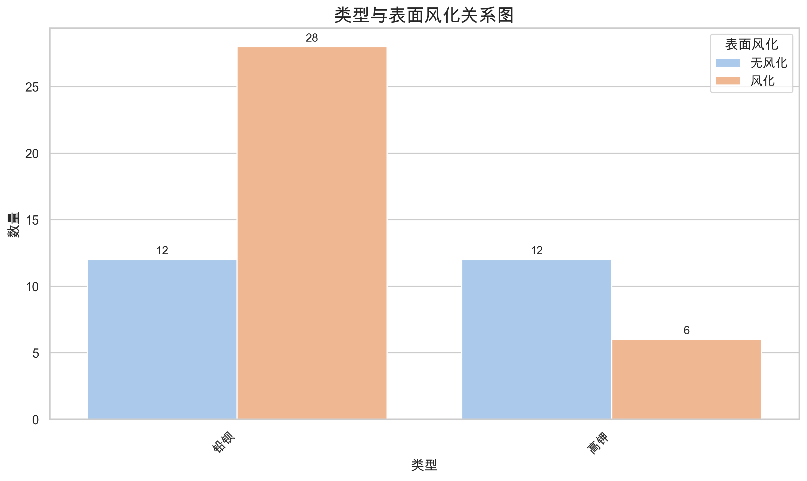
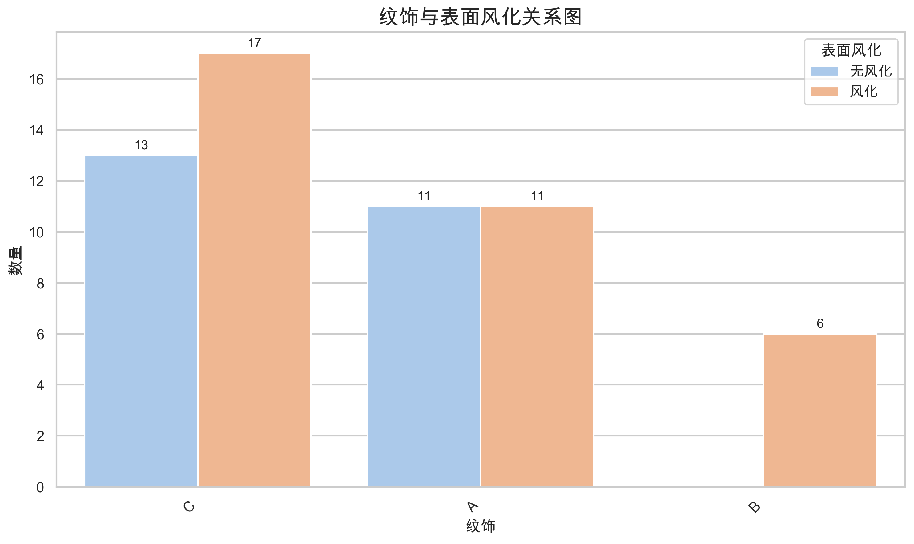
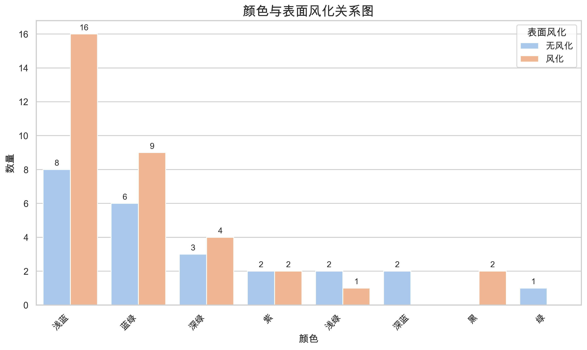

# 玻璃文物统计分析报告

**数据概况：** 共58条有效记录，5个变量

**分析日期：** 2025年06月29日

---

## 类型与表面风化的关系分析

### 类型与表面风化列联表

| 铅钡 | 高钾 | 总计 |
|---|---|---|
| 无风化 | 12 | 12 | 24 |
| 风化 | 28 | 6 | 34 |
| 总计 | 40 | 18 | 58 |

### 卡方检验前提条件检查

**期望频数矩阵：**
类型       铅钡     高钾
表面风化              
无风化   16.55   7.45
风化    23.45  10.55

**统计结果：**
- 总单元格数：4
- 期望频数<1的单元格：0个
- 期望频数<5的单元格：0个 (0.0%)
- **选择方法：皮尔逊卡方检验**
- **理由：所有期望频数≥5，满足标准卡方检验条件**

### 检验结果 (皮尔逊卡方检验)

| 统计量 | 数值 |
|--------|------|
| 卡方统计量 | 5.4518 |
| P值 | 0.0195 |
| 自由度 | 1 |
| Cramer's V | 0.3066 |

### 结论

P值 (0.0195) < 0.05，拒绝原假设。**表面风化与类型存在显著关联**。 Cramer's V 值为 0.3066，表明这是一个**中等强度关联**。

---

## 纹饰与表面风化的关系分析

### 纹饰与表面风化列联表

| A | B | C | 总计 |
|---|---|---|---|
| 无风化 | 11 | 0 | 13 | 24 |
| 风化 | 11 | 6 | 17 | 34 |
| 总计 | 22 | 6 | 30 | 58 |

### 卡方检验前提条件检查

**期望频数矩阵：**
纹饰       A     B      C
表面风化                   
无风化    9.1  2.48  12.41
风化    12.9  3.52  17.59

**统计结果：**
- 总单元格数：6
- 期望频数<1的单元格：0个
- 期望频数<5的单元格：2个 (33.3%)
- **选择方法：Fisher精确检验**
- **理由：33.3%的单元格期望频数<5，超过20%**

### 检验结果 (Fisher精确检验)

| 统计量 | 数值 |
|--------|------|
| 卡方统计量 | 4.9565 |
| P值 | 0.0839 |
| 自由度 | 2 |
| Cramer's V | 0.2923 |
| 备注 | 注：多维表格Fisher检验，此处显示卡方近似值 |

### 结论

P值 (0.0839) ≥ 0.05，不能拒绝原假设。表面风化与纹饰无显著关联。

---

## 颜色与表面风化的关系分析

### 颜色与表面风化列联表

| 浅绿 | 浅蓝 | 深绿 | 深蓝 | 紫 | 绿 | 蓝绿 | 黑 | 总计 |
|---|---|---|---|---|---|---|---|---|
| 无风化 | 2 | 8 | 3 | 2 | 2 | 1 | 6 | 0 | 24 |
| 风化 | 1 | 16 | 4 | 0 | 2 | 0 | 9 | 2 | 34 |
| 总计 | 3 | 24 | 7 | 2 | 4 | 1 | 15 | 2 | 58 |

### 卡方检验前提条件检查

**期望频数矩阵：**
颜色      浅绿     浅蓝   深绿    深蓝     紫     绿    蓝绿     黑
表面风化                                                
无风化   1.24   9.93  2.9  0.83  1.66  0.41  6.21  0.83
风化    1.76  14.07  4.1  1.17  2.34  0.59  8.79  1.17

**统计结果：**
- 总单元格数：16
- 期望频数<1的单元格：4个
- 期望频数<5的单元格：12个 (75.0%)
- **选择方法：Fisher精确检验**
- **理由：存在4个期望频数<1的单元格**

### 检验结果 (Fisher精确检验)

| 统计量 | 数值 |
|--------|------|
| 卡方统计量 | 7.2338 |
| P值 | 0.4050 |
| 自由度 | 7 |
| Cramer's V | 0.3532 |
| 备注 | 注：多维表格Fisher检验，此处显示卡方近似值 |

### 结论

P值 (0.4050) ≥ 0.05，不能拒绝原假设。表面风化与颜色无显著关联。

---

## 分析总结

本报告通过统计检验分析了玻璃文物的表面风化与其类型、纹饰、颜色之间的关联性。

### 检验方法选择原则：
- **标准卡方检验：** 所有期望频数≥5
- **Fisher精确检验：** 存在期望频数<1或>20%单元格期望频数<5

### 前提条件检查：
- ✅ **变量类型：** 所有变量均为分类变量
- ✅ **独立性：** 样本相互独立，每个观测值仅归属一个交叉单元格
- ✅ **期望频数：** 已根据期望频数情况选择合适的检验方法

**显著性水平：** α = 0.05

*报告完成*
