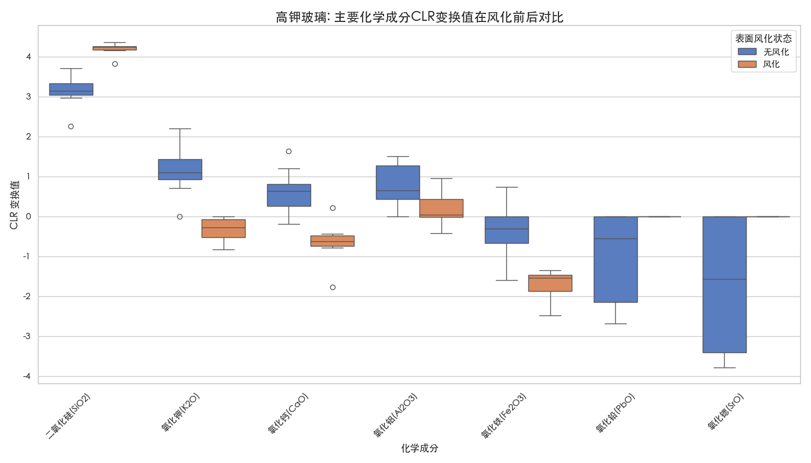
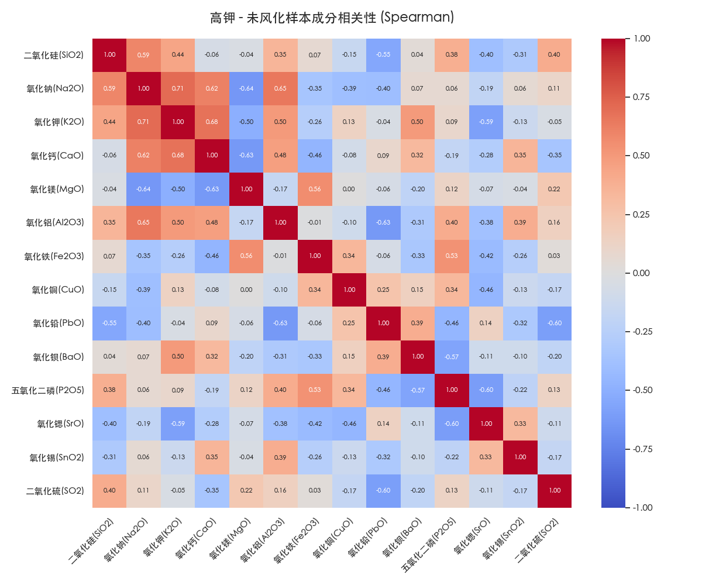
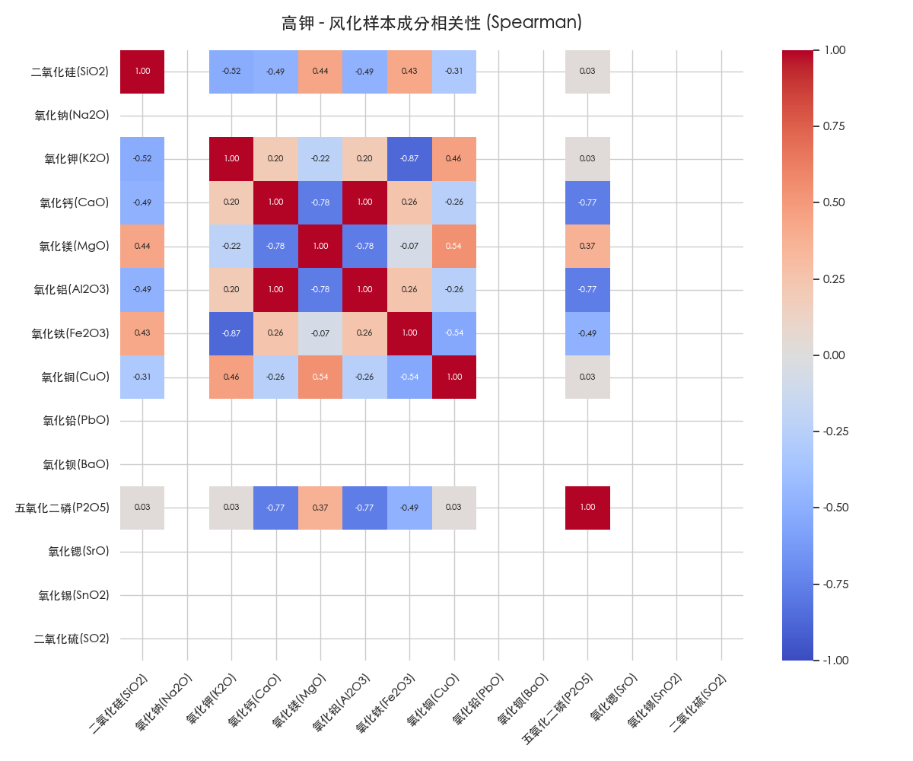
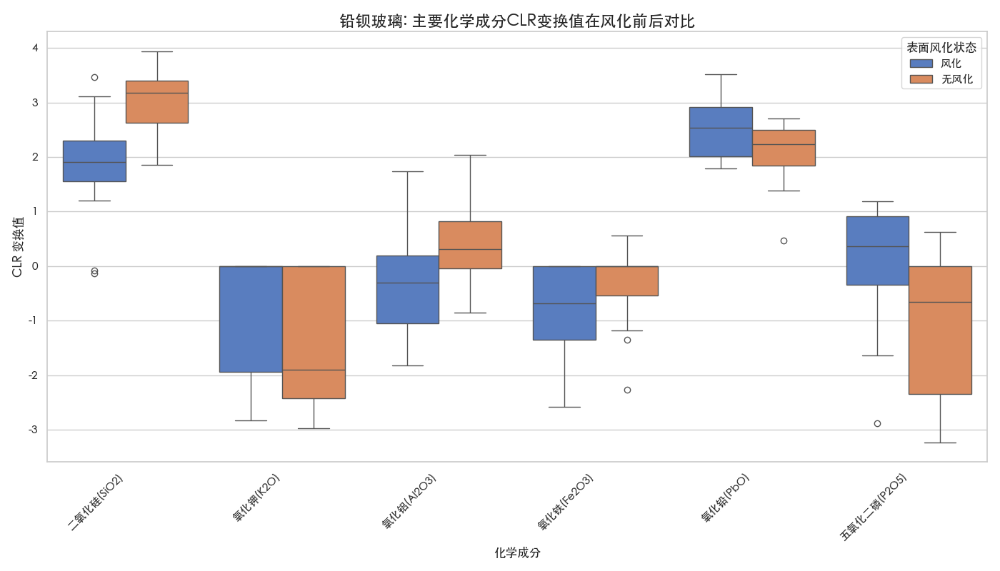
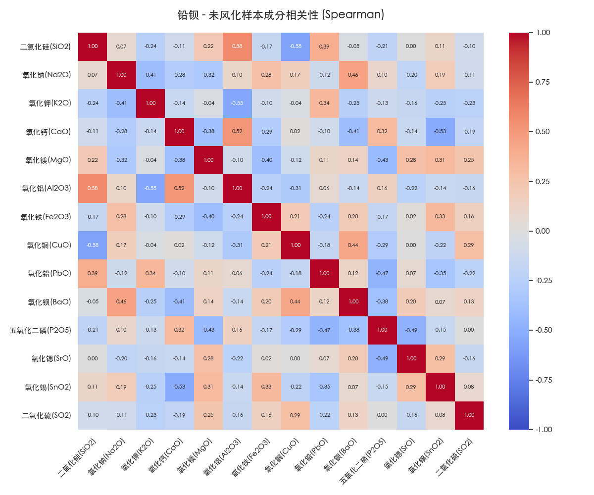
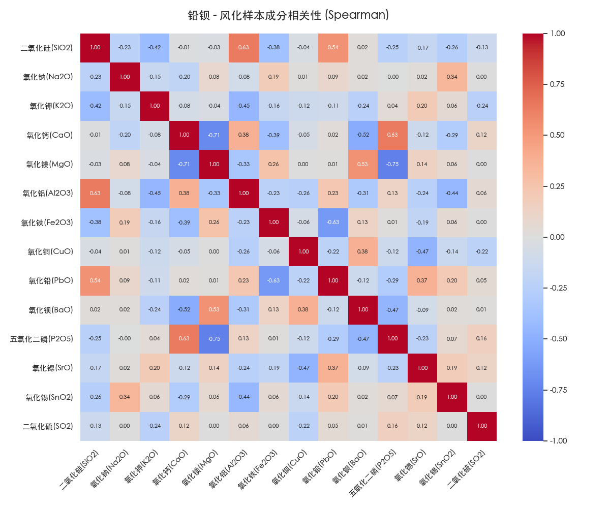

# 古代玻璃化学成分与风化关系分析报告 (基于CLR变换与Spearman相关性)

**报告生成时间**: 2025-06-30 08:49:26

本报告对化学成分数据进行了中心对数比（CLR）变换，以消除成分数据固有的约束。所有后续的统计分析（t检验、相关性分析等）都在变换后的数据上进行。相关性分析采用Spearman等级相关系数，该方法不要求数据呈正态分布，适用性更广。这使得分析结果在统计上更为可靠。

---

## 高钾玻璃分析

### 1. CLR变换值差异与显著性检验

为探究风化对化学成分的影响，我们对风化和未风化样本在CLR空间中的值进行了独立样本t检验。下表总结了各成分CLR变换后的平均值及检验p值。p值小于0.05表示风化前后的差异在统计学上是显著的。

| 化学成分 | 未风化CLR均值 | 风化CLR均值 | p值 | 是否显著 |
|:---|:---:|:---:|:---:|:---|
| 二氧化硅(SiO2) | 3.1657 | 4.1870 | 0.0000 | **是** |
| 氧化钠(Na2O) | -0.0136 | 0.0000 | 0.9020 | 否 |
| 氧化钾(K2O) | 1.1460 | -0.3285 | 0.0000 | **是** |
| 氧化钙(CaO) | 0.5991 | -0.6648 | 0.0004 | **是** |
| 氧化镁(MgO) | -0.6750 | -0.2869 | 0.1155 | 否 |
| 氧化铝(Al2O3) | 0.7761 | 0.1945 | 0.0355 | **是** |
| 氧化铁(Fe2O3) | -0.3905 | -1.7150 | 0.0003 | **是** |
| 氧化铜(CuO) | -0.2629 | -0.0600 | 0.4911 | 否 |
| 氧化铅(PbO) | -0.9873 | 0.0000 | 0.0101 | **是** |
| 氧化钡(BaO) | -0.1798 | 0.0000 | 0.2390 | 否 |
| 五氧化二磷(P2O5) | -0.9385 | -1.3264 | 0.3853 | 否 |
| 氧化锶(SrO) | -1.7238 | 0.0000 | 0.0071 | **是** |
| 氧化锡(SnO2) | -0.0078 | 0.0000 | 0.4962 | 否 |
| 二氧化硫(SO2) | -0.5076 | 0.0000 | 0.2046 | 否 |

**规律总结**：
- 风化过程导致 **二氧化硅(SiO2)** 的相对含量（CLR值）发生**显著增加** (p=0.0000)。
- 风化过程导致 **氧化钾(K2O)** 的相对含量（CLR值）发生**显著减少** (p=0.0000)。
- 风化过程导致 **氧化钙(CaO)** 的相对含量（CLR值）发生**显著减少** (p=0.0004)。
- 风化过程导致 **氧化铝(Al2O3)** 的相对含量（CLR值）发生**显著减少** (p=0.0355)。
- 风化过程导致 **氧化铁(Fe2O3)** 的相对含量（CLR值）发生**显著减少** (p=0.0003)。
- 风化过程导致 **氧化铅(PbO)** 的相对含量（CLR值）发生**显著增加** (p=0.0101)。
- 风化过程导致 **氧化锶(SrO)** 的相对含量（CLR值）发生**显著增加** (p=0.0071)。

### 2. 主要成分CLR变换值分布可视化

以下图通过箱形图展示了CLR值差异显著（或含量最高）的化学成分在风化与未风化样本中的分布情况，直观地体现了其CLR值的中位数、范围和离散程度的变化。

**高钾玻璃主要成分CLR变换值分布**

### 3. CLR变换后成分相关性变化分析 (Spearman)

为探究风化过程中各化学元素间的协同变化关系，我们分别计算了风化前后样本在CLR空间中的成分Spearman等级相关性矩阵，并通过热力图进行可视化。CLR变换消除了成分数据的伪相关性，因此这里的相关性更能反映真实的关联关系。

**未风化样本CLR变换后成分相关性**

**风化样本CLR变换后成分相关性**

**解读**：对比以上两张热力图，可以观察到风化前后，各化学成分在CLR空间中的Spearman相关性（由相关系数的数值和颜色表示）发生了怎样的变化，例如哪些成分间的正/负相关性增强、减弱或逆转。

---

## 铅钡玻璃分析

### 1. CLR变换值差异与显著性检验

为探究风化对化学成分的影响，我们对风化和未风化样本在CLR空间中的值进行了独立样本t检验。下表总结了各成分CLR变换后的平均值及检验p值。p值小于0.05表示风化前后的差异在统计学上是显著的。

| 化学成分 | 未风化CLR均值 | 风化CLR均值 | p值 | 是否显著 |
|:---|:---:|:---:|:---:|:---|
| 二氧化硅(SiO2) | 3.0644 | 1.9008 | 0.0000 | **是** |
| 氧化钠(Na2O) | 0.1282 | -0.0593 | 0.0520 | 否 |
| 氧化钾(K2O) | -1.4354 | -0.7145 | 0.0265 | **是** |
| 氧化钙(CaO) | -0.6184 | -0.3305 | 0.1370 | 否 |
| 氧化镁(MgO) | -0.6232 | -0.6794 | 0.7705 | 否 |
| 氧化铝(Al2O3) | 0.3794 | -0.3874 | 0.0017 | **是** |
| 氧化铁(Fe2O3) | -0.3522 | -0.8430 | 0.0275 | **是** |
| 氧化铜(CuO) | -0.9472 | -0.7664 | 0.4923 | 否 |
| 氧化铅(PbO) | 2.1170 | 2.5337 | 0.0066 | **是** |
| 氧化钡(BaO) | 1.1127 | 1.0723 | 0.8137 | 否 |
| 五氧化二磷(P2O5) | -1.0892 | 0.0974 | 0.0007 | **是** |
| 氧化锶(SrO) | -1.4954 | -1.7645 | 0.2886 | 否 |
| 氧化锡(SnO2) | -0.2522 | -0.0979 | 0.3230 | 否 |
| 二氧化硫(SO2) | 0.0116 | 0.0388 | 0.7469 | 否 |

**规律总结**：
- 风化过程导致 **二氧化硅(SiO2)** 的相对含量（CLR值）发生**显著减少** (p=0.0000)。
- 风化过程导致 **氧化钾(K2O)** 的相对含量（CLR值）发生**显著增加** (p=0.0265)。
- 风化过程导致 **氧化铝(Al2O3)** 的相对含量（CLR值）发生**显著减少** (p=0.0017)。
- 风化过程导致 **氧化铁(Fe2O3)** 的相对含量（CLR值）发生**显著减少** (p=0.0275)。
- 风化过程导致 **氧化铅(PbO)** 的相对含量（CLR值）发生**显著增加** (p=0.0066)。
- 风化过程导致 **五氧化二磷(P2O5)** 的相对含量（CLR值）发生**显著增加** (p=0.0007)。

### 2. 主要成分CLR变换值分布可视化

以下图通过箱形图展示了CLR值差异显著（或含量最高）的化学成分在风化与未风化样本中的分布情况，直观地体现了其CLR值的中位数、范围和离散程度的变化。

**铅钡玻璃主要成分CLR变换值分布**

### 3. CLR变换后成分相关性变化分析 (Spearman)

为探究风化过程中各化学元素间的协同变化关系，我们分别计算了风化前后样本在CLR空间中的成分Spearman等级相关性矩阵，并通过热力图进行可视化。CLR变换消除了成分数据的伪相关性，因此这里的相关性更能反映真实的关联关系。

**未风化样本CLR变换后成分相关性**

**风化样本CLR变换后成分相关性**

**解读**：对比以上两张热力图，可以观察到风化前后，各化学成分在CLR空间中的Spearman相关性（由相关系数的数值和颜色表示）发生了怎样的变化，例如哪些成分间的正/负相关性增强、减弱或逆转。

---

