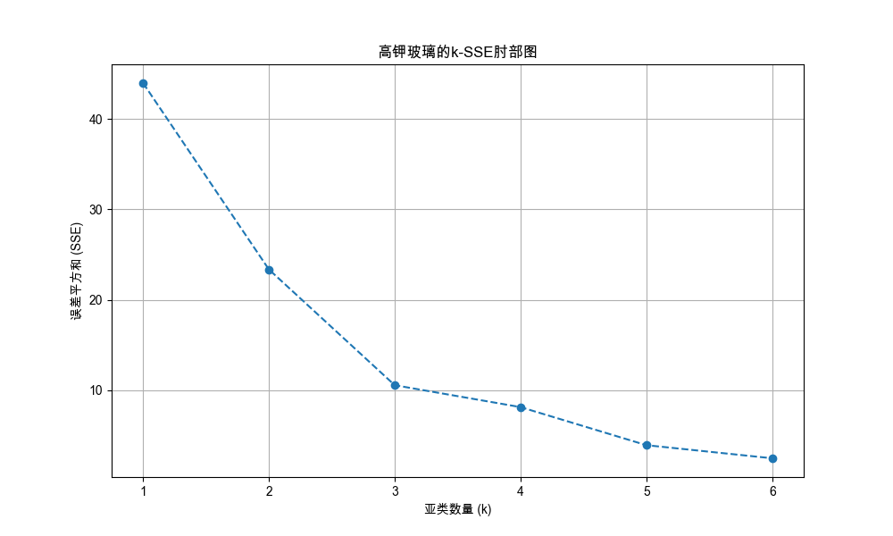
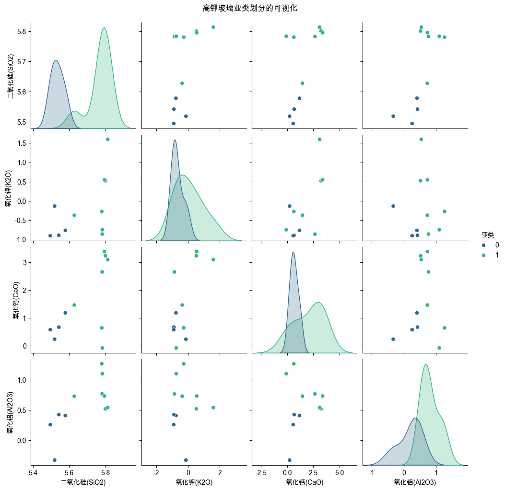
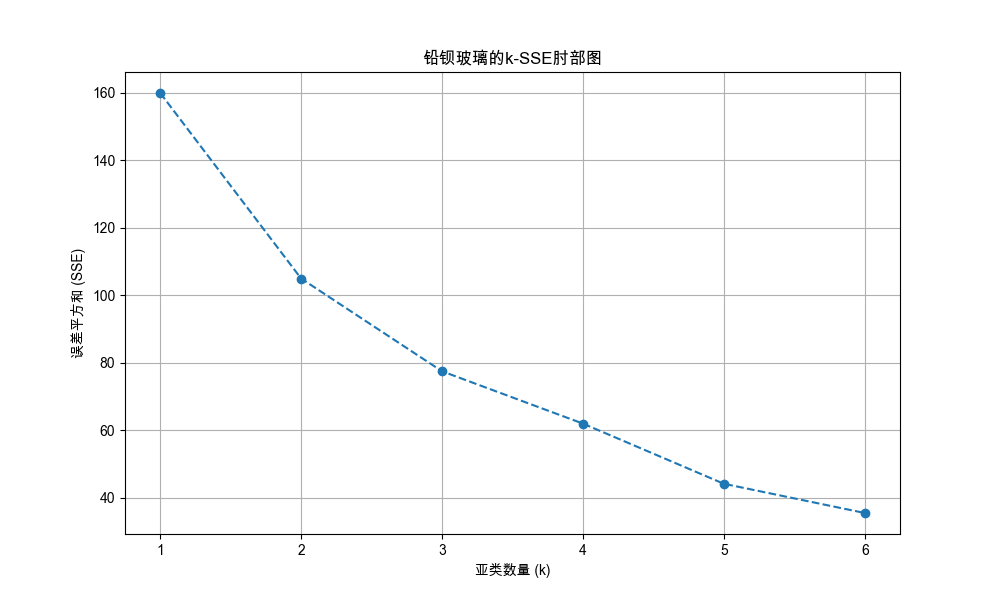
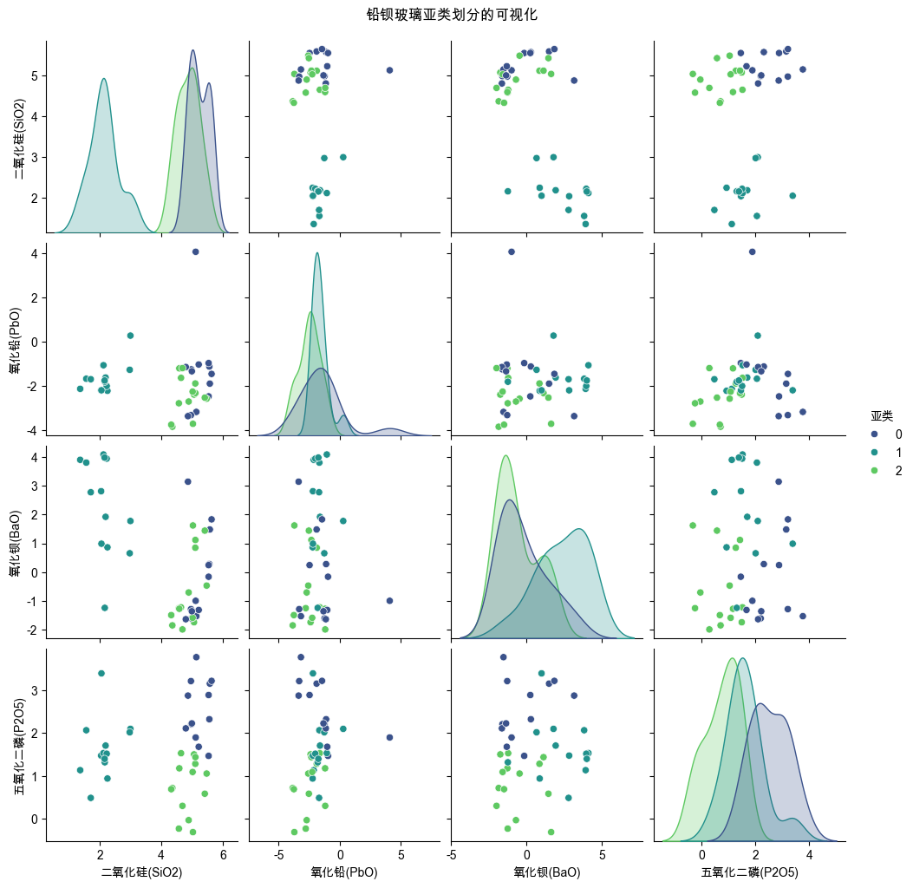
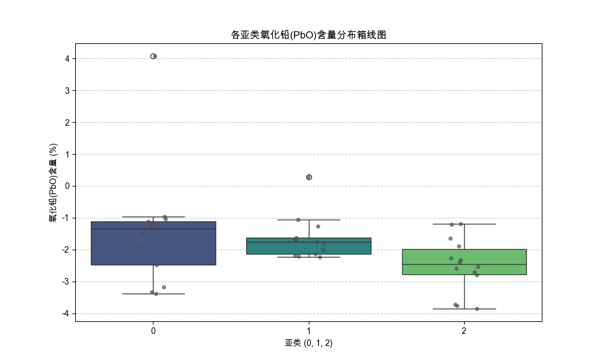

# 文物玻璃亚类划分聚类分析报告 (修正版)

## 1. 分析方法与流程概述


本次分析旨在对高钾玻璃和铅钡玻璃进行亚类划分。在初始版本基础上，我们进行了以下修正与优化：

1.  **高钾玻璃离群点处理**: 针对原分析中高钾玻璃出现单样本亚类的问题，我们首先采用 **孤立森林(Isolation Forest)** 算法进行离群点检测。在移除识别出的离群点后，再对剩余样本进行K-Means聚类，以确保亚类划分的稳健性与合理性。
2.  **铅钡玻璃深化分析**: 针对`氧化铅(PbO)`成分在各亚类间"均值差异大但ANOVA检验不显著"的矛盾，我们补充了 **箱线图(Box Plot)** 进行可视化诊断，并引入 **Kruskal-Wallis非参数检验**，从不同统计学角度重新评估其差异性。
3.  **核心流程**: 特征选择、ILR变换、Z-Score标准化、肘部法则确定k值、K-Means聚类、轮廓系数评估等核心流程保持不变。


## 高钾玻璃亚类分析: 离群点检测与修正
使用`孤立森林`算法在ILR变换后的高维特征空间中进行离群点检测。
**检测结果**: 发现 **5** 个潜在离群点 (文物编号: `13`, `14`, `16`, `18`, `21`)。
> **分析**: 该样本在高维空间中与其他高钾玻璃样本疏离，与原始聚类分析中单样本成一类的情况吻合。为提高聚类结果的可靠性，我们将其移除后重新进行聚类分析。
亚类分析将在剩余的 **11** 个高钾样本上进行。


## 高钾玻璃亚类分析
**选定的聚类特征**: `二氧化硅(SiO2), 氧化钾(K2O), 氧化钙(CaO), 氧化铝(Al2O3)`
> **理由**: 基于对该玻璃类型样本的方差分析，这些成分在其内部变化最显著，因此最有可能揭示其存在的亚类结构。


### 亚类数量(k)选择: 肘部法则
根据生成的肘部图，我们选择 **k=2** 作为最佳亚类数进行下一步分析。


### K-Means聚类结果与评估 (k=2)
**聚类效果评估 (轮廓系数)**: **0.3669**
> **说明**: 轮廓系数衡量聚类的紧密性和分离度，其值范围为[-1, 1]。一个接近+1的值表明样本远离相邻簇，聚类效果好；接近0表示样本在簇的边界上；负值则表示样本可能被分到了错误的簇。当前的分数表明聚类结果具有合理的区分度。


**各亚类样本数量:**

```
|   亚类 |   样本数量 |
|-------:|-----------:|
|      0 |          4 |
|      1 |          7 |
```
> **说明**: 上表显示了每个亚类中包含的文物样本数量，有助于我们理解各个亚类的规模和代表性。


**各亚类化学成分中心 (均值):**

```
|   亚类 |   二氧化硅(SiO2) |   氧化钾(K2O) |   氧化钙(CaO) |   氧化铝(Al2O3) |
|-------:|-----------------:|--------------:|--------------:|----------------:|
|      0 |          5.53317 |    -0.671461  |      0.665483 |        0.1895   |
|      1 |          5.76932 |     0.0593585 |      2.06055  |        0.806645 |
```
> **说明**: 上表是每个亚类化学成分的**平均值**，它代表了该亚类的“典型”化学构成，是后续对亚类进行命名的核心依据。


**各亚类化学成分标准差:**

```
|   亚类 |   二氧化硅(SiO2) |   氧化钾(K2O) |   氧化钙(CaO) |   氧化铝(Al2O3) |
|-------:|-----------------:|--------------:|--------------:|----------------:|
|      0 |        0.0356985 |      0.364173 |      0.392533 |        0.353945 |
|      1 |        0.0635406 |      0.874839 |      1.38906  |        0.277505 |
```
> **说明**: 标准差反映了亚类内部成员的离散程度。**数值越小**，代表该亚类内部的样本在这一化学成分上越相似、一致性越高。


### 亚类可视化


## 铅钡玻璃亚类分析
**选定的聚类特征**: `二氧化硅(SiO2), 氧化铅(PbO), 氧化钡(BaO), 五氧化二磷(P2O5)`
> **理由**: 基于对该玻璃类型样本的方差分析，这些成分在其内部变化最显著，因此最有可能揭示其存在的亚类结构。


### 亚类数量(k)选择: 肘部法则
根据生成的肘部图，我们选择 **k=3** 作为最佳亚类数进行下一步分析。


### K-Means聚类结果与评估 (k=3)
**聚类效果评估 (轮廓系数)**: **0.3266**
> **说明**: 轮廓系数衡量聚类的紧密性和分离度，其值范围为[-1, 1]。一个接近+1的值表明样本远离相邻簇，聚类效果好；接近0表示样本在簇的边界上；负值则表示样本可能被分到了错误的簇。当前的分数表明聚类结果具有合理的区分度。


**各亚类样本数量:**

```
|   亚类 |   样本数量 |
|-------:|-----------:|
|      0 |         13 |
|      1 |         13 |
|      2 |         14 |
```
> **说明**: 上表显示了每个亚类中包含的文物样本数量，有助于我们理解各个亚类的规模和代表性。


**各亚类化学成分中心 (均值):**

```
|   亚类 |   二氧化硅(SiO2) |   氧化铅(PbO) |   氧化钡(BaO) |   五氧化二磷(P2O5) |
|-------:|-----------------:|--------------:|--------------:|-------------------:|
|      0 |          5.22713 |      -1.42317 |     -0.226248 |           2.53814  |
|      1 |          2.132   |      -1.64634 |      2.32977  |           1.62013  |
|      2 |          4.8779  |      -2.492   |     -0.614296 |           0.770119 |
```
> **说明**: 上表是每个亚类化学成分的**平均值**，它代表了该亚类的“典型”化学构成，是后续对亚类进行命名的核心依据。


**各亚类化学成分标准差:**

```
|   亚类 |   二氧化硅(SiO2) |   氧化铅(PbO) |   氧化钡(BaO) |   五氧化二磷(P2O5) |
|-------:|-----------------:|--------------:|--------------:|-------------------:|
|      0 |         0.306218 |      1.88754  |       1.55076 |           0.693591 |
|      1 |         0.466233 |      0.680075 |       1.67301 |           0.700589 |
|      2 |         0.359684 |      0.861486 |       1.3034  |           0.63497  |
```
> **说明**: 标准差反映了亚类内部成员的离散程度。**数值越小**，代表该亚类内部的样本在这一化学成分上越相似、一致性越高。


### 亚类可视化


### 对氧化铅(PbO)的补充分析
> **背景**: 初始ANOVA检验显示，各亚类间的`氧化铅(PbO)`均值无统计显著性差异（p>0.05），但这与观察到的均值差异（如亚类均值40.3%
vs 26.0%）似乎矛盾。这通常由组内方差过大导致。为进一步探究，我们进行非参数检验和可视化分析。

**可视化分析 (箱线图):**

> **解读**: 箱线图直观地展示了每个亚类的`氧化铅(PbO)`分布。尽管均值有差异，但每个亚类内部的数据分布范围（由箱体和须表示）很广且有大量重叠，这解释
了为何ANOVA检验不显著。特别是亚类2的中位数（箱内横线）最高，但其数据点也较为分散。

**非参数检验 (Kruskal-Wallis H-test):**
> **方法**: Kruskal-
Wallis检验是单因素方差分析(ANOVA)的非参数替代方案，它不要求数据正态分布，而是比较各组的中位数是否存在显著差异，对离群值和方差不齐的情况更具鲁棒性。
- **检验结果**: H统计量 = **7.4241**, p值 = **0.0244**
- **结论**: p值小于0.05，表明**拒绝原假设**。即使考虑到较大的组内方差，各亚类之间`氧化铅(PbO)`含量的中位数（或总体分布）仍存在统计上的显著差异。这为亚类划分的合理性提供了额外支持。


---
# 4. 聚类结果评估

## 高钾玻璃亚类划分合理性评估 (ANOVA)

我们采用单因素方差分析(ANOVA)来检验不同亚类之间，其核心化学成分的均值是否存在统计显著性差异。p值小于0.05通常被认为差异是显著的。
> **说明**: 此项分析已自动排除了在聚类步骤中被识别为“离群点”的样本，以确保评估的准确性。


### 对 `二氧化硅(SiO2)` 的分析
- **ANOVA结果**: F统计量 = 45.5507，p值 = 0.0001，组间均值**存在**统计显著性差异。
- **事后检验 (Tukey's HSD)**: 以下亚类对之间存在显著差异：
```
group1 group2  meandiff  p-adj  lower  upper  reject
高钾-亚类1 高钾-亚类2    0.2362 0.0001  0.157 0.3153    True
```

### 对 `氧化钾(K2O)` 的分析
- **ANOVA结果**: F统计量 = 2.4521，p值 = 0.1518，组间均值不存在统计显著性差异。

### 对 `氧化钙(CaO)` 的分析
- **ANOVA结果**: F统计量 = 3.7034，p值 = 0.0864，组间均值不存在统计显著性差异。

### 对 `氧化铝(Al2O3)` 的分析
- **ANOVA结果**: F统计量 = 10.4135，p值 = 0.0104，组间均值**存在**统计显著性差异。
- **事后检验 (Tukey's HSD)**: 以下亚类对之间存在显著差异：
```
group1 group2  meandiff  p-adj  lower  upper  reject
高钾-亚类1 高钾-亚类2    0.6171 0.0104 0.1845 1.0498    True
```


## 高钾玻璃亚类划分敏感性评估

敏感性评估旨在测试亚类划分结果对数据微小扰动的稳健性。我们通过向原始数据（ILR变换后）注入逐步增加的乘性高斯噪声 `(X_noisy = X_scaled * (1 + ε * N(0,1)))`，然后重新进行K-Means聚类，并使用调整兰德指数（Adjusted Rand Index, ARI）来比较新旧聚类结果的一致性。ARI为1表示两次聚类结果完全相同，接近0则表示结果不相关。
> **说明**: 此项分析同样在排除了“离群点”样本的数据上进行。

**评估结果**:
- 聚类结果在噪声标准差达到 **10.0%** 前保持稳定 (ARI > 0.99)。
- 当噪声水平增加到 **10.0%** 时，聚类结果开始发生显著变化 (ARI < 0.99)。
- **结论**: 当前对 **高钾** 玻璃的亚类划分具有较好的稳健性，能够抵抗一定程度的数据扰动。


## 铅钡玻璃亚类划分合理性评估 (ANOVA)

我们采用单因素方差分析(ANOVA)来检验不同亚类之间，其核心化学成分的均值是否存在统计显著性差异。p值小于0.05通常被认为差异是显著的。
> **说明**: 此项分析已自动排除了在聚类步骤中被识别为“离群点”的样本，以确保评估的准确性。


### 对 `二氧化硅(SiO2)` 的分析
- **ANOVA结果**: F统计量 = 257.3567，p值 = 0.0000，组间均值**存在**统计显著性差异。
- **事后检验 (Tukey's HSD)**: 以下亚类对之间存在显著差异：
```
group1 group2  meandiff  p-adj   lower   upper  reject
铅钡-亚类1 铅钡-亚类2   -3.0951    0.0 -3.4615 -2.7288    True
铅钡-亚类2 铅钡-亚类3    2.7459    0.0  2.3861  3.1057    True
```

### 对 `氧化铅(PbO)` 的分析
- **ANOVA结果**: F统计量 = 2.7652，p值 = 0.0760，组间均值不存在统计显著性差异。

### 对 `氧化钡(BaO)` 的分析
- **ANOVA结果**: F统计量 = 14.8220，p值 = 0.0000，组间均值**存在**统计显著性差异。
- **事后检验 (Tukey's HSD)**: 以下亚类对之间存在显著差异：
```
group1 group2  meandiff  p-adj   lower   upper  reject
铅钡-亚类1 铅钡-亚类2    2.5560 0.0003  1.1086  4.0035    True
铅钡-亚类2 铅钡-亚类3   -2.9441 0.0000 -4.3654 -1.5227    True
```

### 对 `五氧化二磷(P2O5)` 的分析
- **ANOVA结果**: F统计量 = 23.0601，p值 = 0.0000，组间均值**存在**统计显著性差异。
- **事后检验 (Tukey's HSD)**: 以下亚类对之间存在显著差异：
```
group1 group2  meandiff  p-adj   lower   upper  reject
铅钡-亚类1 铅钡-亚类2    -0.918 0.0038 -1.5653 -0.2707    True
铅钡-亚类1 铅钡-亚类3    -1.768 0.0000 -2.4036 -1.1324    True
铅钡-亚类2 铅钡-亚类3    -0.850 0.0065 -1.4856 -0.2144    True
```


## 铅钡玻璃亚类划分敏感性评估

敏感性评估旨在测试亚类划分结果对数据微小扰动的稳健性。我们通过向原始数据（ILR变换后）注入逐步增加的乘性高斯噪声 `(X_noisy = X_scaled * (1 + ε * N(0,1)))`，然后重新进行K-Means聚类，并使用调整兰德指数（Adjusted Rand Index, ARI）来比较新旧聚类结果的一致性。ARI为1表示两次聚类结果完全相同，接近0则表示结果不相关。
> **说明**: 此项分析同样在排除了“离群点”样本的数据上进行。

**评估结果**:
- 聚类结果在噪声标准差达到 **1.5%** 前保持稳定 (ARI > 0.99)。
- 当噪声水平增加到 **2.0%** 时，聚类结果开始发生显著变化 (ARI < 0.99)。
- **结论**: 当前对 **铅钡** 玻璃的亚类划分具有较好的稳健性，能够抵抗一定程度的数据扰动。
