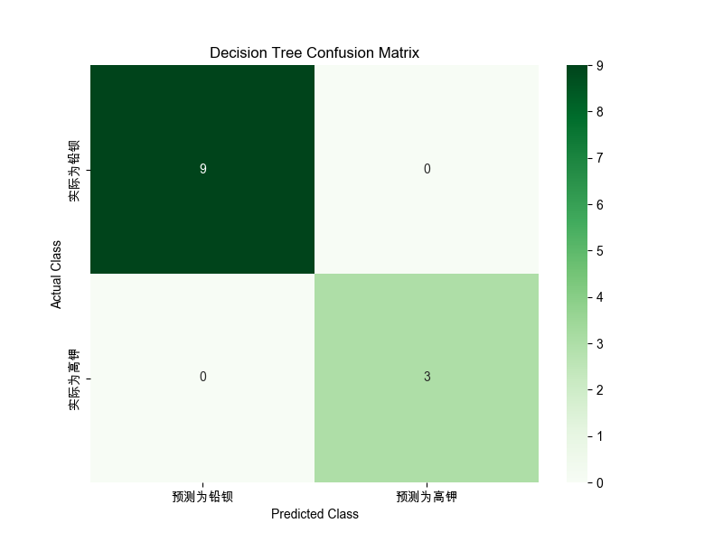

# 决策树模型分析报告


## 1. 数据加载与准备
数据 '2/decision_tree/附件2_处理后.csv' 加载完成。

## 2. 特征工程
特征工程完成。

## 3. 数据划分与标准化
数据已划分为训练集(44条)和测试集(12条)并完成标准化。

## 4. 决策树建模
决策树模型训练完成 (max_depth=5)。

## 5. 模型评估
测试集准确率 (Accuracy): 1.0000

测试集分类报告:

```
              precision    recall  f1-score   support

      铅钡 (0)       1.00      1.00      1.00         9
      高钾 (1)       1.00      1.00      1.00         3

    accuracy                           1.00        12
   macro avg       1.00      1.00      1.00        12
weighted avg       1.00      1.00      1.00        12

```

测试集混淆矩阵:

```
[[9 0]
 [0 3]]
```

混淆矩阵热力图已保存到: decision_tree_confusion_matrix.png

## 6. 决策规则与特征重要性

决策规则 (文本格式):

```
|--- ALR_氧化钡(BaO) <= 0.90
|   |--- ALR_氧化铅(PbO) <= -1.45
|   |   |--- class: 1
|   |--- ALR_氧化铅(PbO) >  -1.45
|   |   |--- class: 0
|--- ALR_氧化钡(BaO) >  0.90
|   |--- ALR_氧化铅(PbO)_x_Weathering <= 0.22
|   |   |--- class: 1
|   |--- ALR_氧化铅(PbO)_x_Weathering >  0.22
|   |   |--- class: 0

```

特征重要性:

```
| Feature                      |   Importance |
|:-----------------------------|-------------:|
| ALR_氧化钡(BaO)              |     0.53884  |
| ALR_氧化铅(PbO)_x_Weathering |     0.257356 |
| ALR_氧化铅(PbO)              |     0.203805 |
```

## 7. 决策树可视化
决策树可视化图已保存到: decision_tree_visualization.png

## 8. 保存模型
决策树模型已保存到: decision_tree_model.joblib
数据缩放器已保存到: scaler.joblib

## 附加图表

### 混淆矩阵热力图



### 决策树可视化图


