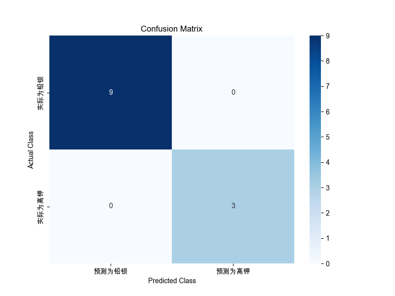
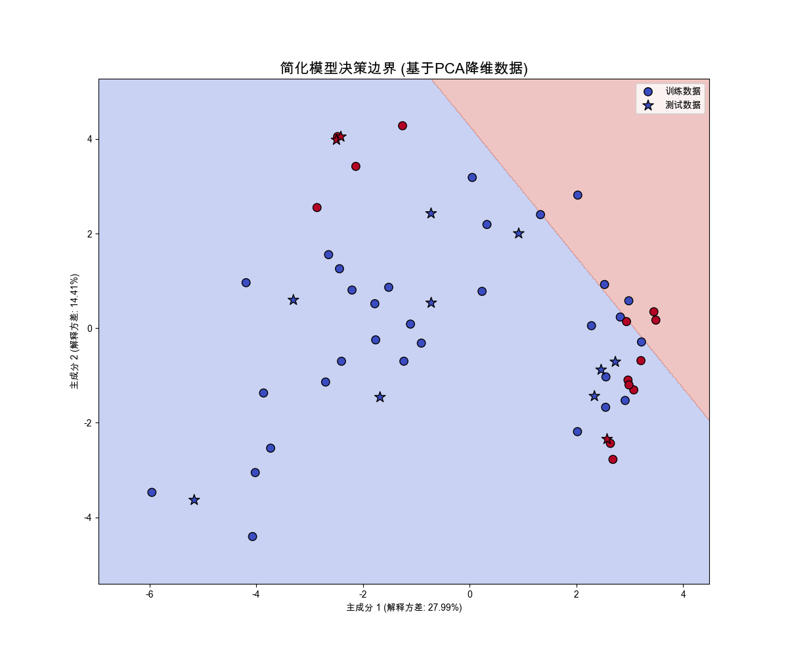

# 逻辑回归模型分析报告

正在加载已处理的数据...
数据加载完成。
筛选出 56 条高钾和铅钡玻璃的数据。
ALR特征中的NaN值已用0填充。
已创建化学成分与风化的交互项。

## 3. 数据划分
数据已划分为训练集 (44条) 和测试集 (12条)。

## 4. 数据标准化
特征数据已完成标准化 (fit on train, transform train/test)。

## 5. 逻辑回归建模
主逻辑回归模型训练完成。

## 6. 模型评估
--- 6.1. 在训练集上的性能 (用于判断过拟合) ---
训练集准确率 (Accuracy): 0.9318

--- 6.2. 在测试集上的性能 (关键评估) ---
测试集准确率 (Accuracy): 1.0000
测试集分类报告 (Classification Report):

```
              precision    recall  f1-score   support

      铅钡 (0)       1.00      1.00      1.00         9
      高钾 (1)       1.00      1.00      1.00         3

    accuracy                           1.00        12
   macro avg       1.00      1.00      1.00        12
weighted avg       1.00      1.00      1.00        12

```
测试集混淆矩阵 (Confusion Matrix):

```
[[9 0]
 [0 3]]
```

混淆矩阵热力图已保存到: confusion_matrix.png
--- 6.3. 模型系数 ---
模型截距 (Intercept): -1.1748

回归系数已保存到: logistic_regression_coefficients.csv
回归系数表 (绝对值排名前10):

```
| Feature                        |   Coefficient |
|:-------------------------------|--------------:|
| ALR_氧化铅(PbO)                |    -1.31181   |
| ALR_氧化锶(SrO)_x_Weathering   |     1.25579   |
| ALR_氧化钡(BaO)                |     1.1081    |
| ALR_氧化铁(Fe2O3)              |    -0.527407  |
| ALR_二氧化硫(SO2)              |    -0.525142  |
| ALR_氧化镁(MgO)                |    -0.42304   |
| ALR_氧化铁(Fe2O3)_x_Weathering |    -0.281559  |
| ALR_氧化钾(K2O)                |     0.0760266 |
| ALR_氧化铝(Al2O3)              |    -0.05766   |
| ALR_氧化铅(PbO)_x_Weathering   |     0         |
```

## 7. 可视化与PCA分析

PCA降维分析:
前两个主成分解释的方差比例: [0.27991727 0.1441372 ]
总解释方差: 0.4241
基于PCA的2D简化模型在测试集上的准确率: 0.7500
分类边界图已保存到: classification_boundary_pca.png

## 8. 保存模型
主模型已保存到: logistic_regression_model.joblib
数据缩放器已保存到: scaler.joblib
PCA转换器已保存到: pca.joblib

## 附加图表

### 混淆矩阵热力图



### 分类边界图


