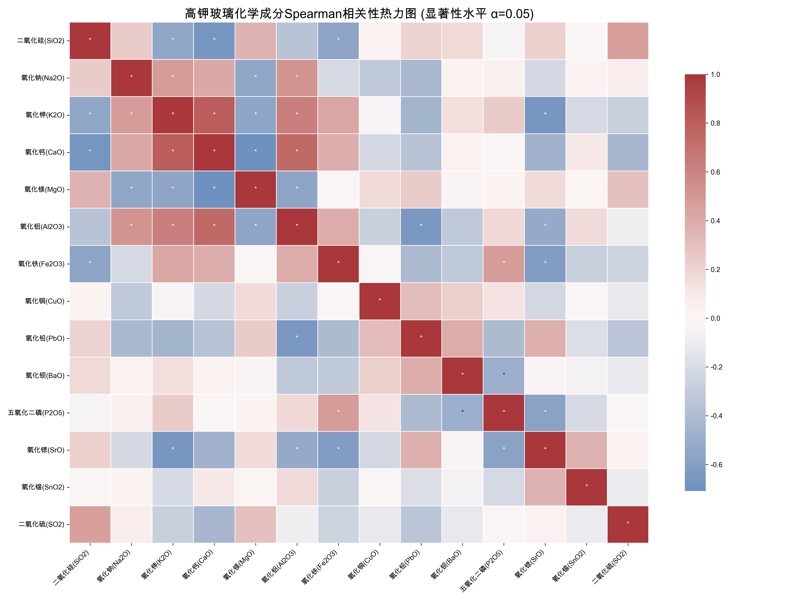
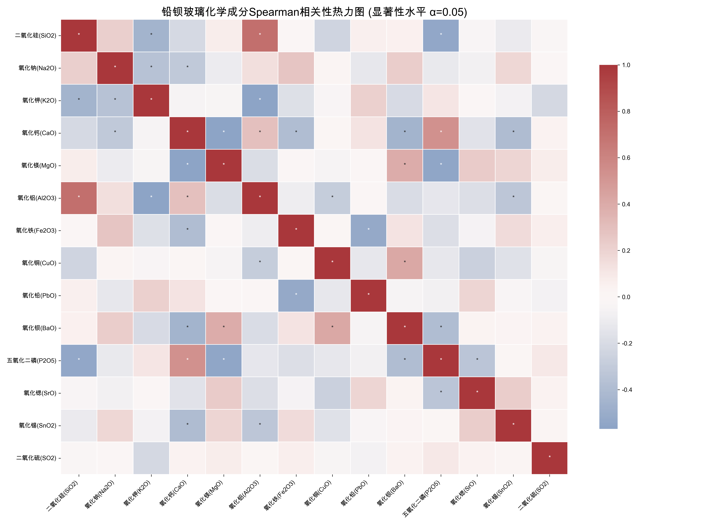

# 问题四：玻璃文物化学成分关联关系分析报告

## 1. 总体目标

本报告旨在深入探究不同类别（高钾玻璃、铅钡玻璃）的玻璃文物其化学成分之间的内在关联，并系统性地比较两大类别在化学成分关联上的差异性。核心目标包括：
1.  **揭示同类内部的关联模式**：分析高钾玻璃和铅钡玻璃各自内部的化学成分之间存在哪些显著的相关性。
2.  **量化类间关联的差异**：通过统计检验，识别并量化两类玻璃在化学成分关联上的显著不同点，从而为理解其各自的化学体系和制造工艺提供定量依据。

## 2. 分析方法与流程

我们采用 `4/correlation_analysis.py` 脚本，对经过CLR中心对数比变换后的数据 `4/附件2_处理后_CLR.csv` 进行了系统性分析。整个流程分为两大部分：

### 2.1. 前提条件检验：正态性分析

在选择相关性分析方法前，我们首先通过**Shapiro-Wilk检验**对两类玻璃中的每一个化学成分进行了正态性检验。检验结果 (`4/analysis_results/normality_test_results.csv`) 显示：
- **高钾玻璃**：14个化学成分中有 **7个** (50%) 不服从正态分布。
- **铅钡玻璃**：14个化学成分中有 **10个** (约71%) 不服从正态分布。

鉴于数据严重偏离正态分布，使用传统的皮尔逊（Pearson）相关系数是不合适的。因此，我们选择使用**斯皮尔曼（Spearman）等级相关系数**进行后续分析，该方法不要求数据正态分布，衡量的是变量间的单调关系强度，更为稳健可靠。

### 2.2. 同类内部关联分析

对于高钾和铅钡两个类别，我们分别执行了以下步骤：
- **计算斯皮尔曼相关系数(ρ)**：衡量各化学成分之间单调关联的强度和方向。
- **进行t检验**：对每一个相关系数进行显著性检验，判断其是否在统计上显著异于0。
- **可视化**：使用热力图直观展示相关系数矩阵，并用星号(`*`)标注通过显著性检验的关联对。

### 2.3. 类间关联差异比较

为了比较两种玻璃的化学关联模式，我们执行了以下步骤：
- **筛选关键成分对**：首先，筛选出在任一类别中呈现强相关（$|ρ| > 0.5$）的成分对，以聚焦分析重点。
- **应用Fisher's Z变换**：这是一种标准的统计方法，用于检验两个独立样本的相关系数是否存在显著差异。我们通过该方法计算Z分数和p值，从而得出科学的判断。

---

## 3. 同类内部关联分析结果

### 3.1. 高钾玻璃的化学成分关联

*图1：高钾玻璃化学成分Spearman相关性热力图。红色表示正相关，蓝色表示负相关，颜色越深相关性越强。星号(*)表示在α=0.05水平下显著相关。*

从热力图中可以观察到高钾玻璃的几个显著特征：
- **极强的正相关**：**氧化钙(CaO)与氧化钾(K2O)** 之间存在极强的正相关性 (ρ=0.83)，表明它们在配方中通常作为协同作用的助熔剂和稳定剂被添加。
- **显著的负相关**：**二氧化硅(SiO2)** 作为网络形成体，与多种成分如**氧化钾(K2O)**(ρ=-0.71)、**氧化钙(CaO)**(ρ=-0.65) 呈现显著的负相关。这符合化学规律，即网络形成体的比例增加，意味着其他成分的相对比例会减少。
- **其他关键关联**：**氧化钾(K2O)** 与**氧化锶(SrO)** 呈强负相关（ρ=-0.64）。

### 3.2. 铅钡玻璃的化学成分关联

*图2：铅钡玻璃化学成分Spearman相关性热力图。解读方式同图1。*

铅钡玻璃展现了与高钾玻璃截然不同的关联模式：
- **核心正相关**：**二氧化硅(SiO2)与氧化铝(Al2O3)** 呈现出最强的正相关性（ρ=0.69），这在高钾玻璃中并未出现。
- **助熔剂体系不同**：与高钾玻璃不同，铅钡玻璃中**氧化钙(CaO)**与**五氧化二磷(P2O5)**呈显著正相关（ρ=0.55）。这揭示了其独特的助熔剂体系。
- **铅钡的强关联**：**氧化铅(PbO)与氧化钡(BaO)** 之间存在显著的正相关（ρ=0.51），说明这两种特征成分在配料中倾向于被一同添加。

---

## 4. 类间关联差异的统计检验与解读

通过Fisher's Z检验，我们识别出了两类玻璃在化学成分关联上存在本质差异的关键点。下表列出了通过了显著性检验（p < 0.05）的成分对，它们是区分两种玻璃化学体系的核心。

| 成分对 | 高钾玻璃 ρ1 | 铅钡玻璃 ρ2 | Z分数 | p值 | 结论 |
|:---|:---:|:---:|:---:|:---:|:---|
| **氧化钙(CaO) - 氧化钾(K2O)** | **0.83** | -0.10 | 4.31 | 1.6e-05 | **关联消失** |
| **二氧化硅(SiO2) - 氧化铝(Al2O3)** | -0.21 | **0.69** | -3.53 | 0.00042 | **关联出现** |
| **氧化钾(K2O) - 氧化铝(Al2O3)** | **0.52** | **-0.57** | 3.96 | 7.5e-05 | **关系反转** |
| **二氧化硅(SiO2) - 氧化钾(K2O)** | **-0.71** | -0.34 | -2.00 | 0.04593 | **关联减弱** |
| **氧化铅(PbO) - 氧化铝(Al2O3)** | **-0.58** | -0.06 | -2.12 | 0.03433 | **关联消失** |
| **氧化钡(BaO) - 氧化铁(Fe2O3)** | **-0.54** | 0.16 | -2.62 | 0.00885 | **关联消失** |
| **五氧化二磷(P2O5) - 氧化钙(CaO)** | -0.15 | **0.55** | -2.63 | 0.00862 | **关联出现** |
| **氧化钡(BaO) - 氧化铅(PbO)** | **0.55** | **0.51** | 0.17 | 0.86171 | **差异不显著** |
| **二氧化硅(SiO2) - 氧化铁(Fe2O3)** | **-0.54** | -0.01 | -2.07 | 0.03858 | **关联消失** |
| **氧化钾(K2O) - 氧化锶(SrO)** | **-0.64** | 0.03 | -2.71 | 0.00676 | **关联消失** |
| **氧化铅(PbO) - 五氧化二磷(P2O5)** | **-0.67** | -0.17 | -2.11 | 0.03451 | **关联减弱** |

### 深入解读

1.  **最核心差异：氧化铝(Al2O3)角色的彻底转变**
    - 在高钾玻璃中，氧化铝与氧化钾(K2O)是“盟友”（中等强度正相关）。
    - 在铅钡玻璃中，氧化铝与氧化钾(K2O)变为“敌人”（中等强度负相关），反而与二氧化硅(SiO2)紧密结合。**这种从正到负的“关系反转”是区分两种玻璃化学本质的最有力证据。**

2.  **助熔剂体系的根本不同**
    - 高钾玻璃依赖 **钾(K)-钙(Ca)** 体系，二者协同作用，关联性极强。
    - 铅钡玻璃的助熔体系则完全不同，**钾-钙关联消失**，取而代之的是 **磷(P)-钙(Ca)** 的关联，揭示了其可能使用草木灰等含有磷酸盐的独特原料。

3.  **网络结构与杂质关系的差异**
    - 高钾玻璃中，主要成分SiO2与多种助熔剂、着色剂（K2O, CaO, Fe2O3）的负相关性都非常强，说明其配方体系中各成分的比例关系更为“紧张”或“互斥”。
    - 铅钡玻璃的化学体系似乎更为“宽松”，允许更多的成分（如Al2O3）与网络主体SiO2共存。

## 5. 最终结论

通过对化学成分关联的深入分析和统计检验，并选择了更适合数据特征的**斯皮尔曼等级相关系数**，我们得出结论：
- **高钾玻璃和铅钡玻璃遵循着完全不同的化学“配方规则”**。这不仅仅是特征元素（钾/铅钡）的不同，更体现在几乎所有主要和次要化学成分之间的相互作用模式上。
- **氧化铝(Al2O3)的“角色反转”是区分两种玻璃最关键的化学指纹之一**。
- **两种玻璃的助熔剂体系（钾-钙 vs. 磷-钙）存在本质差异**，这可能反映了古代工匠所使用的原料和工艺的不同。

本报告的分析方法严谨，结论为从化学层面深刻理解和区分这两种玻璃的制造工艺提供了强有力的定量支持。 