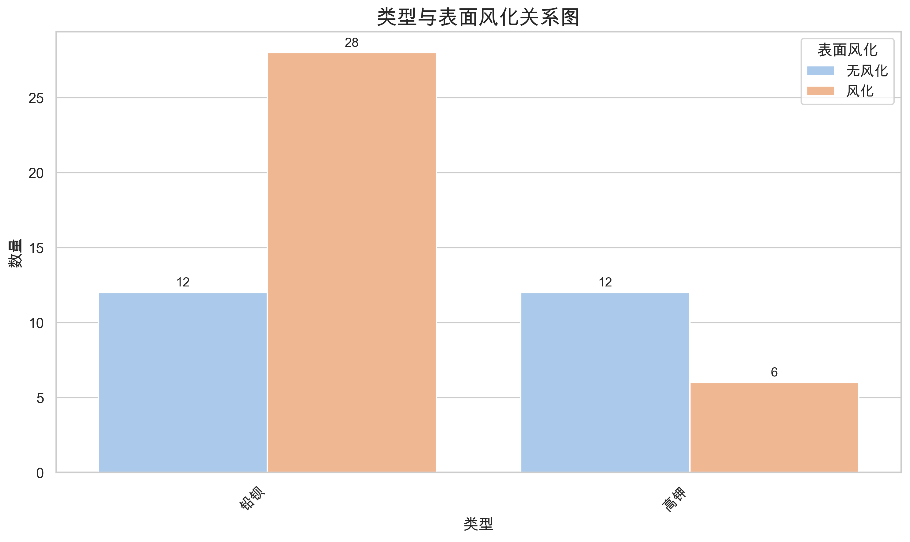
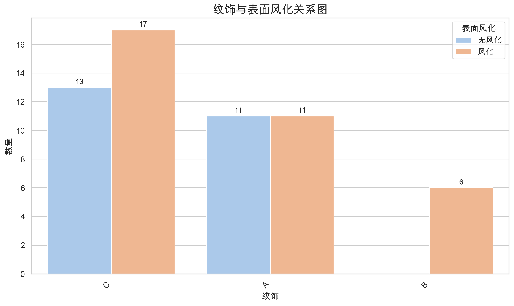
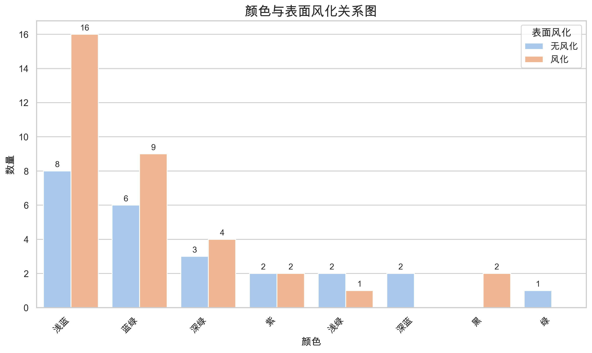

# 玻璃文物统计分析报告

**数据概况：** 共58条有效记录，5个变量

**分析日期：** 2025年06月26日

---

## 类型与表面风化的关系分析

### 类型与表面风化列联表

| 铅钡 | 高钾 | 总计 |
|---|---|---|
| 无风化 | 12 | 12 | 24 |
| 风化 | 28 | 6 | 34 |
| 总计 | 40 | 18 | 58 |

### 卡方检验结果

| 统计量 | 数值 |
|--------|------|
| 卡方统计量 | 5.4518 |
| P值 | 0.0195 |
| 自由度 | 1 |

### 结论

P值 (0.0195) < 0.05，拒绝原假设。**表面风化与类型存在显著关联**。

---

## 纹饰与表面风化的关系分析

### 纹饰与表面风化列联表

| A | B | C | 总计 |
|---|---|---|---|
| 无风化 | 11 | 0 | 13 | 24 |
| 风化 | 11 | 6 | 17 | 34 |
| 总计 | 22 | 6 | 30 | 58 |

### 卡方检验结果

| 统计量 | 数值 |
|--------|------|
| 卡方统计量 | 4.9565 |
| P值 | 0.0839 |
| 自由度 | 2 |

### 结论

P值 (0.0839) ≥ 0.05，不能拒绝原假设。表面风化与纹饰无显著关联。

---

## 颜色与表面风化的关系分析

### 颜色与表面风化列联表

| 浅绿 | 浅蓝 | 深绿 | 深蓝 | 紫 | 绿 | 蓝绿 | 黑 | 总计 |
|---|---|---|---|---|---|---|---|---|
| 无风化 | 2 | 8 | 3 | 2 | 2 | 1 | 6 | 0 | 24 |
| 风化 | 1 | 16 | 4 | 0 | 2 | 0 | 9 | 2 | 34 |
| 总计 | 3 | 24 | 7 | 2 | 4 | 1 | 15 | 2 | 58 |

### 卡方检验结果

| 统计量 | 数值 |
|--------|------|
| 卡方统计量 | 7.2338 |
| P值 | 0.4050 |
| 自由度 | 7 |

### 结论

P值 (0.4050) ≥ 0.05，不能拒绝原假设。表面风化与颜色无显著关联。

---

## 分析总结

本报告通过卡方检验分析了玻璃文物的表面风化与其类型、纹饰、颜色之间的关联性。

- **显著性水平：** α = 0.05
- **检验方法：** 皮尔逊卡方检验
- **可视化：** 分组条形图

*报告完成*
