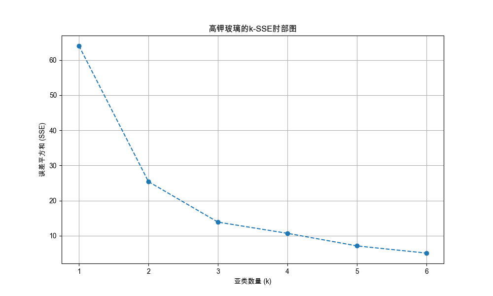
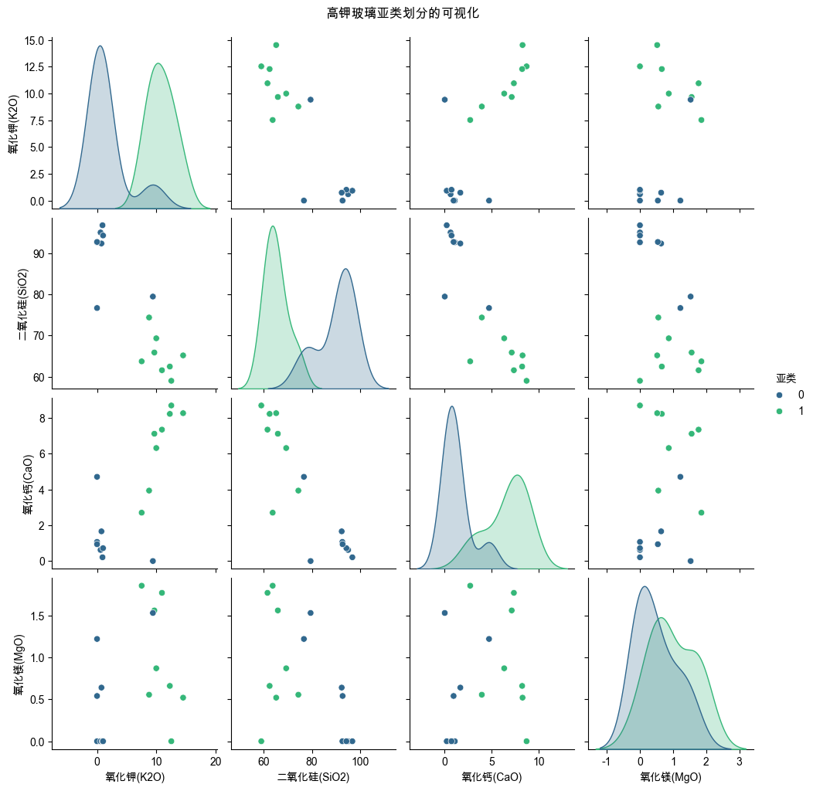
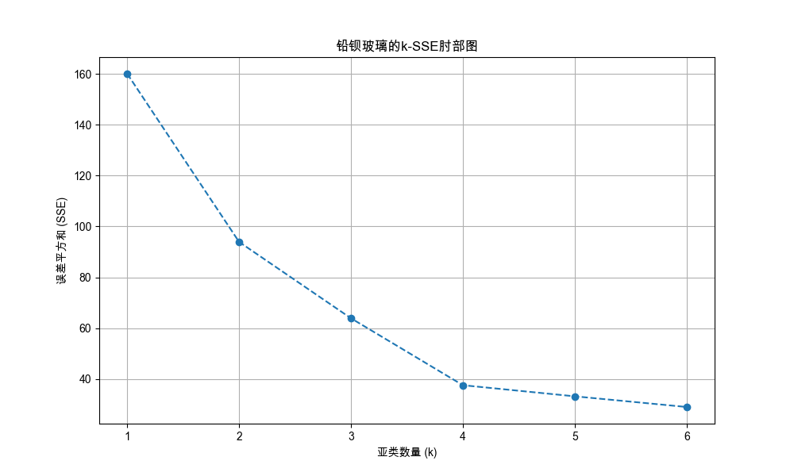
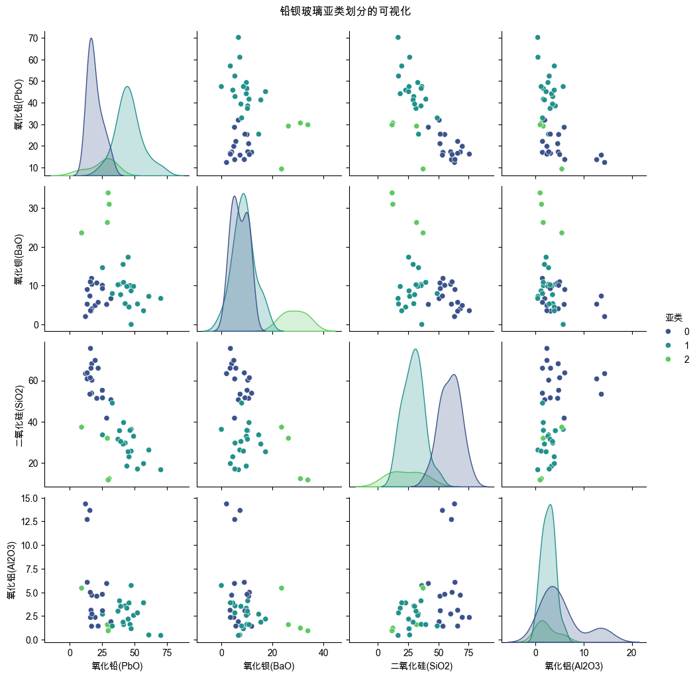

# 文物玻璃亚类划分聚类分析报告

## 1. 分析方法概述

本次分析旨在对高钾玻璃和铅钡玻璃进行亚类划分，以揭示其内部更精细的化学成分差异。我们采用了以下步骤：

1.  **特征选择**: 针对不同玻璃类型，选取最能代表其化学特性的核心成分作为聚类特征。
2.  **数据标准化**: 对选定的化学成分数据进行Z-Score标准化，以消除不同成分含量数量级差异对距离计算的影响。
3.  **确定亚类数量 (k值)**: 我们使用**"肘部法则" (Elbow Method)**，通过计算不同k值下的误差平方和(SSE)，并观察k-SSE曲线的拐点，来为每个主要类别选择最佳的亚类数量。
4.  **K-Means聚类**: 采用K-Means++算法进行初始化，以避免随机初始化导致的局部最优问题，并对样本进行聚类。
5.  **结果分析与命名**: 基于每个亚类的化学成分中心（即各类成分的平均值），对亚类进行命名，以突出其最核心的成分特征。

---

## 2. 高钾玻璃 (High-Potassium Glass) 亚类分析

### 2.1. 肘部法则与k值选择

我们为高钾玻璃生成了k-SSE肘部图，根据曲线的"拐点"趋势，选择 **k=2** 作为最佳的亚类数量。



### 2.2. 亚类化学成分中心与命名

我们对高钾玻璃聚类得到了两个亚类，其化学成分中心（原始值）如下：

```
|   亚类 |   氧化钾(K2O) |   二氧化硅(SiO2) |   氧化钙(CaO) |   氧化镁(MgO) |
|-------:|--------------:|-----------------:|--------------:|--------------:|
|      0 |        1.585  |           89.99  |       1.24125 |       0.49125 |
|      1 |       10.7806 |           65.195 |       6.57937 |       0.97375 |
```

**分析与命名:**

*   **高钾-亚类1 (原聚类0): "超高硅-低钾亚类"**
    *   **特征**: 此亚类的化学成分极为独特，其**二氧化硅(SiO2)含量接近90%**，而作为高钾玻璃标志的**氧化钾(K2O)含量却非常低**。
    *   **解读**: 这可能是一类特殊的、更接近纯粹石英砂原料的玻璃，或是经历了某种程度的元素流失。

*   **高钾-亚类2 (原聚类1): "典型高钾亚类"**
    *   **特征**: 此亚类表现出典型的高钾玻璃特征，即**氧化钾(K2O)含量非常高 (平均超过10%)**，同时二氧化硅含量也维持在较高水平。
    *   **解读**: 这是标准的高钾玻璃样本群体。



---

## 3. 铅钡玻璃 (Lead-Barium Glass) 亚类分析

### 3.1. 肘部法则与k值选择

我们为铅钡玻璃生成了k-SSE肘部图，根据曲线的"拐点"趋势，选择 **k=3** 作为最佳的亚类数量。



### 3.2. 亚类化学成分中心与命名

我们对铅钡玻璃聚类得到了三个亚类，其化学成分中心（原始值）如下：

```
|   亚类 |   氧化铅(PbO) |   氧化钡(BaO) |   二氧化硅(SiO2) |   氧化铝(Al2O3) |
|-------:|--------------:|--------------:|-----------------:|----------------:|
|      0 |       19.3712 |       7.06118 |          59.5115 |         5.30147 |
|      1 |       45.5445 |       8.68658 |          29.2518 |         2.62895 |
|      2 |       24.6825 |      28.6388  |          23.3575 |         2.30125 |
```

**分析与命名:**

*   **铅钡-亚类1 (原聚类0): "高硅-铅钡亚类"**
    *   **特征**: 此亚类的**二氧化硅(SiO2)含量在三个亚类中是最高的 (接近60%)**，而氧化铅(PbO)和氧化钡(BaO)的含量相对较低。
    *   **解读**: 这可能是一种过渡类型的铅钡玻璃，其配方中硅酸盐的比例更高。

*   **铅钡-亚类2 (原聚类1): "高铅-低钡亚类"**
    *   **特征**: 此亚类最显著的特征是其**氧化铅(PbO)含量极高 (平均超过45%)**，是典型的"高铅"配方。
    *   **解读**: 这是以氧化铅为主要助熔剂的铅钡玻璃亚类。

*   **铅钡-亚类3 (原聚类2): "高钡-中铅亚类"**
    *   **特征**: 此亚类的**氧化钡(BaO)含量极为突出 (平均超过28%)**，远高于其他两个亚类。
    *   **解读**: 这是以氧化钡为重要特征成分的铅钡玻璃亚-类，可能具有特殊的物理或化学性质。



---

## 4. 分析的合理性与敏感性

*   **合理性**: 
    1.  **数据标准化**: 对原始数据进行Z-Score标准化是必要的，它消除了不同化学成分（如含量百分比高的SiO2和含量百分比低的MgO）之间的量纲差异，使得聚类算法能够公平地衡量每个特征的贡献。
    2.  **K-Means++ 初始化**: 使用K-Means++算法进行初始化，而非完全随机，有助于聚类中心更快地收敛到全局最优位置，提高了结果的稳定性和可靠性。

*   **敏感性**:
    1.  **特征选择**: 聚类结果高度依赖于初始选择的化学成分特征。如果选择不同的特征组合，亚类的划分结果可能会发生变化。
    2.  **k值的选择**: 尽管"肘部法则"提供了一种科学的指导，但在某些"肘部"不明显的图表中，k值的选择仍可能带有些许主观性，不同的k值会直接导致不同的亚类数量和划分结果。

本次分析在上述框架下，提供了一套具有高可解释性的亚类划分方案。

## 1. 数据加载
数据 '2.1/附件2_处理后.csv' 加载完成。

## ----- 开始处理: 高钾玻璃 -----
选定的聚类特征: 氧化钾(K2O), 二氧化硅(SiO2), 氧化钙(CaO), 氧化镁(MgO)

--- 2.1. 肘部法则确定亚类数量(k) ---
k-SSE肘部图已保存到: elbow_plot_高钾.png

--- 2.2. K-Means聚类 (选择 k=2) ---

各亚类化学成分中心 (标准化后):

```
|   亚类 |   氧化钾(K2O) |   二氧化硅(SiO2) |   氧化钙(CaO) |   氧化镁(MgO) |
|-------:|--------------:|-----------------:|--------------:|--------------:|
|      0 |     -0.871419 |         0.902415 |     -0.837302 |     -0.372145 |
|      1 |      0.871419 |        -0.902415 |      0.837302 |      0.372145 |
```

各亚类化学成分中心 (原始值):

```
|   亚类 |   氧化钾(K2O) |   二氧化硅(SiO2) |   氧化钙(CaO) |   氧化镁(MgO) |
|-------:|--------------:|-----------------:|--------------:|--------------:|
|      0 |        1.585  |           89.99  |       1.24125 |       0.49125 |
|      1 |       10.7806 |           65.195 |       6.57937 |       0.97375 |
```
亚类可视化Pair Plot图已保存到: pairplot_高钾.png
K-Means模型和缩放器已保存。

## ----- 开始处理: 铅钡玻璃 -----
选定的聚类特征: 氧化铅(PbO), 氧化钡(BaO), 二氧化硅(SiO2), 氧化铝(Al2O3)

--- 2.1. 肘部法则确定亚类数量(k) ---
k-SSE肘部图已保存到: elbow_plot_铅钡.png

--- 2.2. K-Means聚类 (选择 k=3) ---

各亚类化学成分中心 (标准化后):

```
|   亚类 |   氧化铅(PbO) |   氧化钡(BaO) |   二氧化硅(SiO2) |   氧化铝(Al2O3) |
|-------:|--------------:|--------------:|-----------------:|----------------:|
|      0 |     -0.862701 |     -0.40379  |         1.01221  |        0.494306 |
|      1 |      0.879098 |     -0.179776 |        -0.690473 |       -0.347407 |
|      2 |     -0.509239 |      2.57005  |        -1.02214  |       -0.450616 |
```

各亚类化学成分中心 (原始值):

```
|   亚类 |   氧化铅(PbO) |   氧化钡(BaO) |   二氧化硅(SiO2) |   氧化铝(Al2O3) |
|-------:|--------------:|--------------:|-----------------:|----------------:|
|      0 |       19.3712 |       7.06118 |          59.5115 |         5.30147 |
|      1 |       45.5445 |       8.68658 |          29.2518 |         2.62895 |
|      2 |       24.6825 |      28.6388  |          23.3575 |         2.30125 |
```
亚类可视化Pair Plot图已保存到: pairplot_铅钡.png
K-Means模型和缩放器已保存。

## 4. 结果合并与保存
包含亚类划分结果的最终数据已保存到: 附件2_亚类划分后.csv

## 附图：高钾玻璃


## 附图：铅钡玻璃


