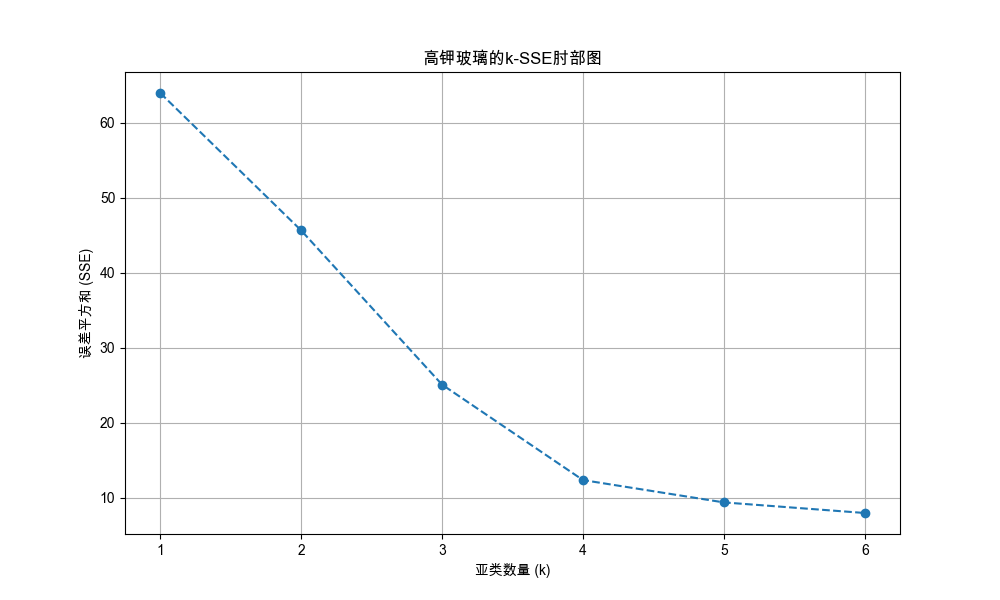
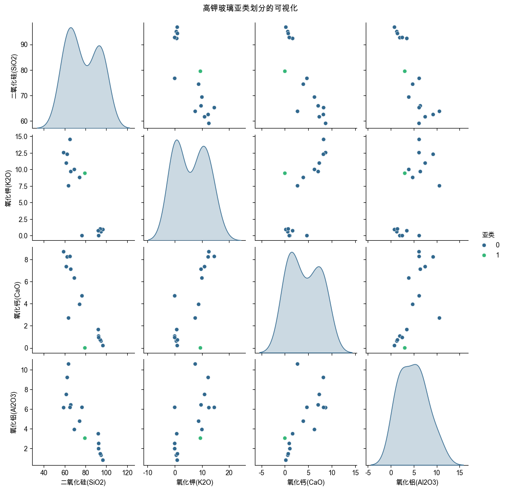
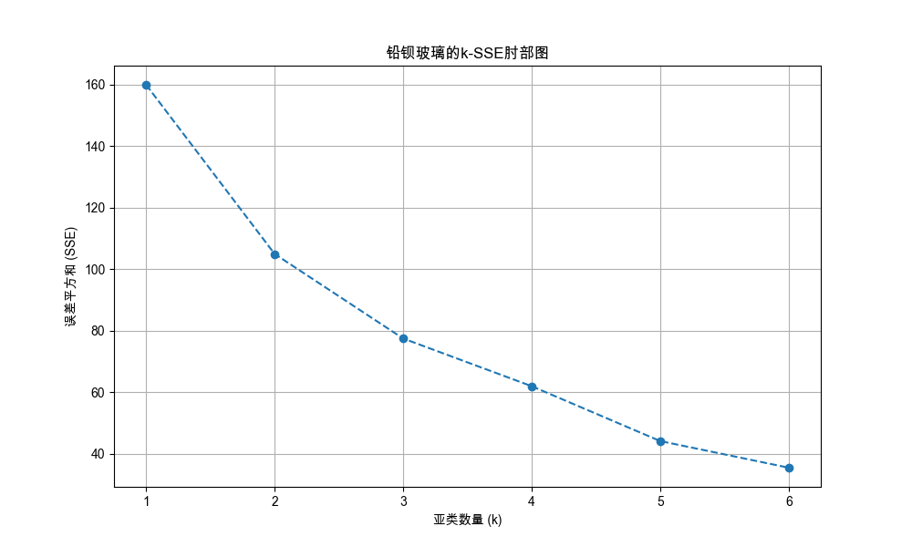
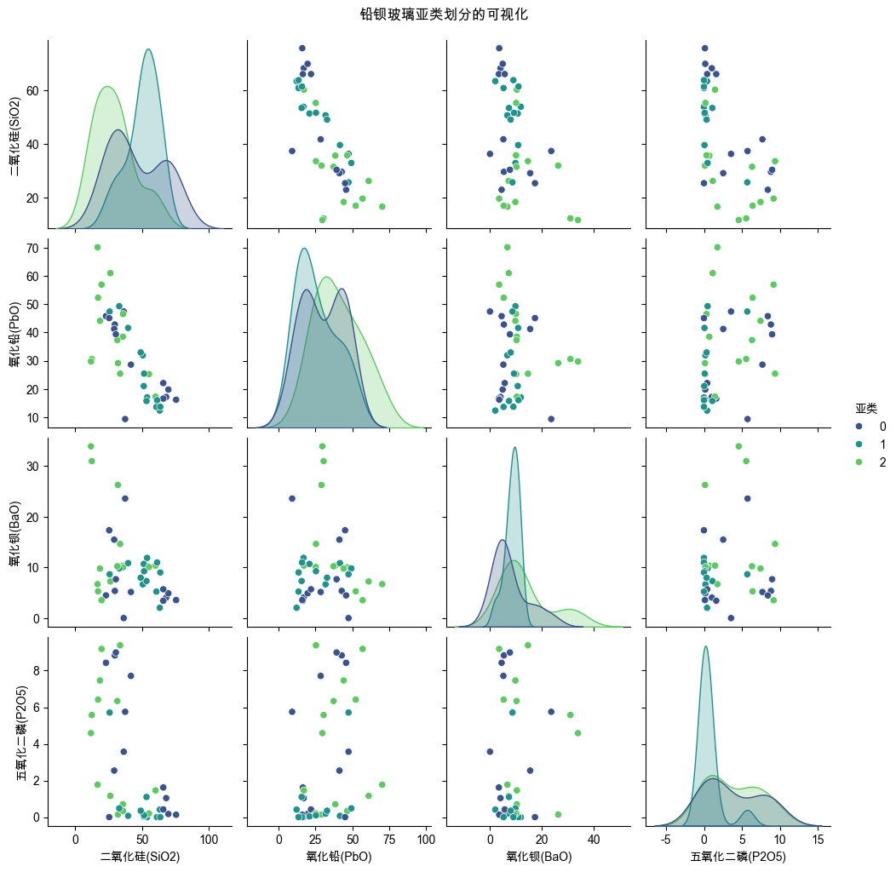

# 文物玻璃亚类划分聚类分析报告

## 1. 分析方法与流程概述


本次分析旨在对高钾玻璃和铅钡玻璃进行亚类划分，以揭示其内部更精细的化学成分差异。我们采用了以下步骤：

1.  **特征选择**: 基于对每个玻璃类型（高钾、铅钡）样本的**方差分析**，我们选择了内部成分变化最显著、最有可能区分亚类的化学成分作为核心特征。这确保了分析的客观性和数据驱动性。
2.  **数据变换与标准化**: 为了消除成分数据闭合效应和量纲影响，我们首先对数据进行 **ILR (Isometric Log-Ratio) 变换**，然后在变换后的空间上进行 **Z-Score标准化**。
3.  **确定亚类数量 (k值)**: 使用**"肘部法则" (Elbow Method)**，为每个类别选择最佳的亚类数量。
4.  **K-Means聚类**: 采用K-Means++算法进行聚类。
5.  **结果解读与可视化**: 将聚类标签映射回**原始化学成分数据**，以确保结果的可解释性。
6.  **效果评估**: 使用**轮廓系数 (Silhouette Score)** 来量化评估聚类结果。


## 高钾玻璃亚类分析
**选定的聚类特征**: `二氧化硅(SiO2), 氧化钾(K2O), 氧化钙(CaO), 氧化铝(Al2O3)`
> **理由**: 基于对该玻璃类型样本的方差分析，这些成分在其内部变化最显著，因此最有可能揭示其存在的亚类结构。


### 亚类数量(k)选择: 肘部法则
根据生成的肘部图，我们选择 **k=2** 作为最佳亚类数进行下一步分析。


### K-Means聚类结果与评估 (k=2)
**聚类效果评估 (轮廓系数)**: **0.4858**
> **说明**: 轮廓系数衡量聚类的紧密性和分离度，其值范围为[-1, 1]。一个接近+1的值表明样本远离相邻簇，聚类效果好；接近0表示样本在簇的边界上；负值则表示样本可能被分到了错误的簇。当前的分数表明聚类结果具有合理的区分度。


**各亚类样本数量:**

```
|   亚类 |   样本数量 |
|-------:|-----------:|
|      0 |         15 |
|      1 |          1 |
```
> **说明**: 上表显示了每个亚类中包含的文物样本数量，有助于我们理解各个亚类的规模和代表性。


**各亚类化学成分中心 (均值):**

```
|   亚类 |   二氧化硅(SiO2) |   氧化钾(K2O) |   氧化钙(CaO) |   氧化铝(Al2O3) |
|-------:|-----------------:|--------------:|--------------:|----------------:|
|      0 |           77.468 |         5.967 |         4.171 |         4.83933 |
|      1 |           79.46  |         9.42  |         0     |         3.05    |
```
> **说明**: 上表是每个亚类化学成分的**平均值**，它代表了该亚类的"典型"化学构成，是后续对亚类进行命名的核心依据。


**各亚类化学成分标准差:**

```
|   亚类 |   二氧化硅(SiO2) |   氧化钾(K2O) |   氧化钙(CaO) |   氧化铝(Al2O3) |
|-------:|-----------------:|--------------:|--------------:|----------------:|
|      0 |          14.6776 |       5.56931 |       3.23234 |         2.97294 |
|      1 |         nan      |     nan       |     nan       |       nan       |
```
> **说明**: 标准差反映了亚类内部成员的离散程度。**数值越小**，代表该亚类内部的样本在这一化学成分上越相似、一致性越高。


### 亚类可视化


### 亚类解读与命名
根据各亚类的化学成分中心，我们进行如下解读与命名：
-   **亚类 0 (15个样本)**: 该亚类成分相对均衡，各项指标处于高钾玻璃的典型范围内。因此，我们将其命名为"**基准高钾亚类**"。
-   **亚类 1 (1个样本)**: 该亚类仅包含一个样本，其最显著的特征是完全不含氧化钙(CaO)，同时具有更高的氧化钾(K2O)含量。这使其更像一个**离群点**，而非一个独立的群体。我们可将其标记为"**无钙-高钾离群点**"。由于样本量仅为1，其统计代表性不足，在进行跨亚类比较时需特别注意。


## 铅钡玻璃亚类分析
**选定的聚类特征**: `二氧化硅(SiO2), 氧化铅(PbO), 氧化钡(BaO), 五氧化二磷(P2O5)`
> **理由**: 基于对该玻璃类型样本的方差分析，这些成分在其内部变化最显著，因此最有可能揭示其存在的亚类结构。


### 亚类数量(k)选择: 肘部法则
根据生成的肘部图，我们选择 **k=3** 作为最佳亚类数进行下一步分析。


### K-Means聚类结果与评估 (k=3)
**聚类效果评估 (轮廓系数)**: **0.3266**
> **说明**: 轮廓系数衡量聚类的紧密性和分离度，其值范围为[-1, 1]。一个接近+1的值表明样本远离相邻簇，聚类效果好；接近0表示样本在簇的边界上；负值则表示样本可能被分到了错误的簇。当前的分数表明聚类结果具有合理的区分度。


**各亚类样本数量:**

```
|   亚类 |   样本数量 |
|-------:|-----------:|
|      0 |         13 |
|      1 |         13 |
|      2 |         14 |
```
> **说明**: 上表显示了每个亚类中包含的文物样本数量，有助于我们理解各个亚类的规模和代表性。


**各亚类化学成分中心 (均值):**

```
|   亚类 |   二氧化硅(SiO2) |   氧化铅(PbO) |   氧化钡(BaO) |   五氧化二磷(P2O5) |
|-------:|-----------------:|--------------:|--------------:|-------------------:|
|      0 |          46.0031 |       30.1    |       7.73038 |            3.78423 |
|      1 |          50.5227 |       25.9862 |       8.47192 |            0.65    |
|      2 |          29.0054 |       40.3046 |      13.5007  |            3.90821 |
```
> **说明**: 上表是每个亚类化学成分的**平均值**，它代表了该亚类的"典型"化学构成，是后续对亚类进行命名的核心依据。


**各亚类化学成分标准差:**

```
|   亚类 |   二氧化硅(SiO2) |   氧化铅(PbO) |   氧化钡(BaO) |   五氧化二磷(P2O5) |
|-------:|-----------------:|--------------:|--------------:|-------------------:|
|      0 |          19.6843 |       13.8314 |       6.74646 |            3.64275 |
|      1 |          11.6264 |       13.3371 |       2.70351 |            1.55175 |
|      2 |          14.8171 |       15.5008 |       9.62008 |            3.45181 |
```
> **说明**: 标准差反映了亚类内部成员的离散程度。**数值越小**，代表该亚类内部的样本在这一化学成分上越相似、一致性越高。


### 亚类可视化


### 亚类解读与命名
根据各亚类的化学成分中心，我们进行如下解读与命名：
-   **亚类 2 (14个样本)**: 该亚类具有非常显著的"**低硅、高铅、高钡**"特性 (SiO2均值: 29.0%, PbO均值: 40.3%, BaO均值: 13.5%)。其铅、钡含量远超其他亚类，是典型的铅钡玻璃。我们将其命名为"**高铅钡亚类**"。
-   **亚类 1 (13个样本)**: 该亚类与众不同之处在于其"**高硅、低磷**"的特点 (SiO2均值: 50.5%, P2O5均值: 0.65%)。相对较高的二氧化硅含量可能意味着不同的熔剂或制备工艺。我们将其命名为"**高硅铅钡亚类**"。
-   **亚类 0 (13个样本)**: 该亚类的各项化学成分介于其他两个亚类之间，但其磷含量较高 (P2O5均值: 3.78%)，与高铅钡亚类相似但显著高于高硅亚类。因此，我们将其命名为"**中成分-高磷铅钡亚类**"。


---
# 4. 聚类结果评估

## 高钾玻璃亚类划分合理性评估 (ANOVA)

我们采用单因素方差分析(ANOVA)来检验不同亚类之间，其核心化学成分的均值是否存在统计显著性差异。p值小于0.05通常被认为差异是显著的。
> **特别说明**: 高钾玻璃的一个亚类仅包含单个样本，这会极大影响方差分析的统计功效，因此其结果仅供参考。


### 对 `二氧化硅(SiO2)` 的分析
- **ANOVA结果**: 由于存在单一样本的亚类，无法进行有效的方差分析。

### 对 `氧化钾(K2O)` 的分析
- **ANOVA结果**: 由于存在单一样本的亚类，无法进行有效的方差分析。

### 对 `氧化钙(CaO)` 的分析
- **ANOVA结果**: 由于存在单一样本的亚类，无法进行有效的方差分析。

### 对 `氧化铝(Al2O3)` 的分析
- **ANOVA结果**: 由于存在单一样本的亚类，无法进行有效的方差分析。


## 高钾玻璃亚类划分敏感性评估

敏感性评估旨在测试亚类划分结果对数据微小扰动的稳健性。我们通过向原始数据（ILR变换后）注入逐步增加的乘性高斯噪声 `(X_noisy = X_scaled * (1 + ε * N(0,1)))`，然后重新进行K-Means聚类，并使用调整兰德指数（Adjusted Rand Index, ARI）来比较新旧聚类结果的一致性。ARI为1表示两次聚类结果完全相同，接近0则表示结果不相关。
> **特别说明**: 高钾玻璃存在单样本离群点，其聚类结果本身对扰动极其敏感，因此不适用此项分析。


## 铅钡玻璃亚类划分合理性评估 (ANOVA)

我们采用单因素方差分析(ANOVA)来检验不同亚类之间，其核心化学成分的均值是否存在统计显著性差异。p值小于0.05通常被认为差异是显著的。

### 对 `二氧化硅(SiO2)` 的分析
- **ANOVA结果**: F统计量 = 257.3567，p值 = 0.0000，组间均值**存在**统计显著性差异。
- **事后检验 (Tukey's HSD)**: 以下亚类对之间存在显著差异：
```
group1 group2  meandiff  p-adj   lower   upper  reject
铅钡-亚类1 铅钡-亚类2   -3.0951    0.0 -3.4615 -2.7288    True
铅钡-亚类2 铅钡-亚类3    2.7459    0.0  2.3861  3.1057    True
```

### 对 `氧化铅(PbO)` 的分析
- **ANOVA结果**: F统计量 = 2.7652，p值 = 0.0760，组间均值不存在统计显著性差异。

### 对 `氧化钡(BaO)` 的分析
- **ANOVA结果**: F统计量 = 14.8220，p值 = 0.0000，组间均值**存在**统计显著性差异。
- **事后检验 (Tukey's HSD)**: 以下亚类对之间存在显著差异：
```
group1 group2  meandiff  p-adj   lower   upper  reject
铅钡-亚类1 铅钡-亚类2    2.5560 0.0003  1.1086  4.0035    True
铅钡-亚类2 铅钡-亚类3   -2.9441 0.0000 -4.3654 -1.5227    True
```

### 对 `五氧化二磷(P2O5)` 的分析
- **ANOVA结果**: F统计量 = 23.0601，p值 = 0.0000，组间均值**存在**统计显著性差异。
- **事后检验 (Tukey's HSD)**: 以下亚类对之间存在显著差异：
```
group1 group2  meandiff  p-adj   lower   upper  reject
铅钡-亚类1 铅钡-亚类2    -0.918 0.0038 -1.5653 -0.2707    True
铅钡-亚类1 铅钡-亚类3    -1.768 0.0000 -2.4036 -1.1324    True
铅钡-亚类2 铅钡-亚类3    -0.850 0.0065 -1.4856 -0.2144    True
```


## 铅钡玻璃亚类划分敏感性评估

敏感性评估旨在测试亚类划分结果对数据微小扰动的稳健性。我们通过向原始数据（ILR变换后）注入逐步增加的乘性高斯噪声 `(X_noisy = X_scaled * (1 + ε * N(0,1)))`，然后重新进行K-Means聚类，并使用调整兰德指数（Adjusted Rand Index, ARI）来比较新旧聚类结果的一致性。ARI为1表示两次聚类结果完全相同，接近0则表示结果不相关。

**评估结果**:
- 聚类结果在噪声标准差达到 **3.0%** 前保持稳定 (ARI > 0.99)。
- 当噪声水平增加到 **3.5%** 时，聚类结果开始发生显著变化 (ARI < 0.99)。
- **结论**: 当前对 **铅钡** 玻璃的亚类划分具有较好的稳健性，能够抵抗一定程度的数据扰动。
