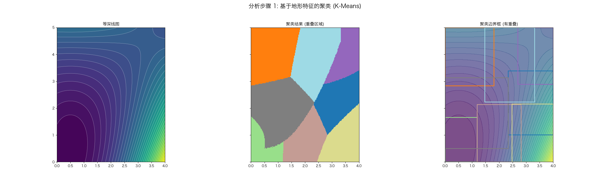

# 海域矩形区域划分分析报告

本文档总结了通过两步法对海域数据进行区域划分的过程和结果。

## 第一步：基于K-Means聚类的初步分析

此步骤旨在通过聚类算法直观地识别地形特征相似的区域。

- **聚类数量 (n_clusters):** `8`

聚类结果（如下图 `clustering_analysis.png` 所示）揭示了地形的内在结构，但其生成的边界框存在重叠，不适用于直接的测线规划。

## 第二步：基于递归分割的最终方案

为得到无重叠、全覆盖的矩形区域，我们采用递归分割算法对整个海域进行划分。

### 使用的参数
- **最大递归深度 (max_depth):** `3`
- **坡向方差阈值 (aspect_variance_threshold):** `0.7`
- **区域最小网格数 (min_cells):** `200`

### 最终矩形区域坐标

总共划分出 **7** 个独立的矩形区域。详细坐标如下：

| 区域编号 | X 范围 (min, max) | Y 范围 (min, max) |
|:---:|:---:|:---:|
| 0 | (0.00, 0.98) | (0.00, 2.49) |
| 1 | (0.98, 1.99) | (0.00, 2.49) |
| 2 | (0.00, 1.99) | (2.49, 5.00) |
| 3 | (1.99, 2.99) | (0.00, 2.49) |
| 4 | (2.99, 4.00) | (0.00, 2.49) |
| 5 | (1.99, 2.99) | (2.49, 5.00) |
| 6 | (2.99, 4.00) | (2.49, 5.00) |

## 第三步：各区域平面拟合、参数计算与优度检验

对第二步划分出的每个矩形区域，我们提取其内部的原始数据点，并拟合一个最佳近似平面 `z = β₀ + β₁x + β₂y`。根据拟合结果，我们计算出每个区域的平均坡度和坡向，并通过 **R²分数** 和 **均方根误差 (RMSE)** 来评估拟合的准确性。

- **R² 分数**: 范围0-1，越接近1，表示平面模型对地形的解释能力越强。
- **RMSE (m)**: 模型的预测误差，单位为米，值越小表示拟合偏差越小。

### 计算结果摘要

| 区域编号 | 数据点数 | β₀ | β₁ | β₂ | 坡度(α)/° | 坡向(φ)/° | R² 分数 | RMSE (m) |
|:---:|:---:|:---:|:---:|:---:|:---:|:---:|:---:|:---:|
| 0 | 6250 | 18.85 | -0.21 | 4.47 | 77.40 | -87.33 | 0.785 | 1.690 |
| 1 | 6375 | 2.36 | 20.45 | 1.39 | 87.21 | -176.12 | 0.888 | 2.164 |
| 2 | 12600 | -16.58 | 2.35 | 18.97 | 87.00 | -97.07 | 0.975 | 2.241 |
| 3 | 6250 | -27.61 | 41.52 | -8.20 | 88.65 | 168.82 | 0.948 | 3.145 |
| 4 | 6375 | -70.68 | 62.59 | -24.34 | 89.15 | 158.75 | 0.971 | 4.421 |
| 5 | 6300 | 11.93 | 9.55 | 7.86 | 85.38 | -140.55 | 0.809 | 3.083 |
| 6 | 6426 | 57.94 | 14.40 | -8.28 | 86.55 | 150.11 | 0.738 | 4.389 |
